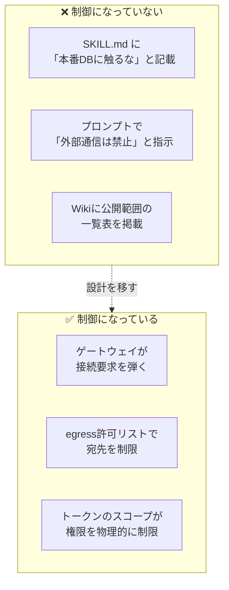
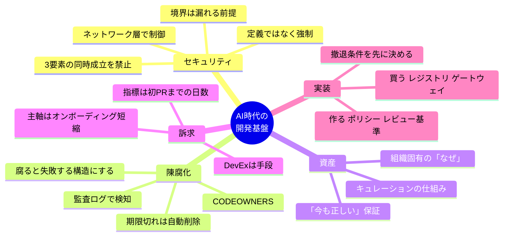

# AI時代の開発基盤の内製化 — 議論のまとめ

作成日: 2026-08-01

---

## 目次

1. [出発点：最初の考え](#1-出発点最初の考え)
2. [評価：どこが正しかったか](#2-評価どこが正しかったか)
3. [修正すべき3つの論点](#3-修正すべき3つの論点)
4. [追加・補足された論点](#4-追加補足された論点)
5. [設計方針：何を買い、何を作るか](#5-設計方針何を買い何を作るか)
6. [個人でできること](#6-個人でできること)
7. [参考リンク](#7-参考リンク)

---

## 1. 出発点：最初の考え

議論の起点となった主張は以下の通り。

- どの会社にも、AIを使用した開発体制・方針の**内製化**が必要である
- MCPやSkillsを社内エンジニアに共有し、**簡易にアクセスできる仕組み**が重要
  - ただし**公開範囲の指定**は必須。プロジェクト固有の機密情報を漏らしてはならない
- 社内**API管理体制**の整備が必要
  - どんなAPIが存在するか / 利用できるか / 公開範囲はどうか
- この領域（API・MCP・Skillsの管理システム設計）は**現状人間にしかできない**
  - 雑なシステムはAIでも作れるが、雑なシステムではダメ
  - あるプロジェクトで便利だったMCP/Skillsを、そのまま全社共有してよいわけではない
  - 必ず人間による確認が必要
- これらすべての共通目的は、**開発者のUXを上げること**

---

## 2. 評価：どこが正しかったか

結論として、この方向性は**正しい**。しかも直感ではなく、すでに業界が同じ結論に到達している。

| 最初の主張 | 業界での対応する概念 | 現状 |
|---|---|---|
| MCP/Skillsに簡易アクセスできる仕組み | MCP Registry（カタログ・発見層） | 商用製品が複数存在 |
| 公開範囲の指定 | ID基盤に紐づくアクセス制御 | 多くのレジストリで未実装＝業界の穴 |
| 人間による確認が必要 | 承認ワークフロー / サプライチェーン統制 | 「ガバナンスがMCP普及に追いついていない」が共通認識 |
| 社内API管理体制 | サービスカタログ / API ガバナンス | AI以前からの未解決課題。AIが緊急度を上げた |

エンタープライズ向けMCPガバナンスに必要とされる4要素は以下とされる。

1. 集中カタログ
2. ID基盤に紐づくアクセス制御
3. 構造化された監査ログ
4. リアルタイムのポリシー適用

**「公開範囲の指定が必要」という直感は、2と3をまとめて指していた。**

---

## 3. 修正すべき3つの論点

主張の骨格は正しいが、そのままだと社内で通しにくい／論として脆い箇所が3つある。

### 修正サマリ

| # | 元の主張 | 修正後 | 修正の理由 |
|---|---|---|---|
| 1 | この領域は**人間にしかできない** | 人間しか**責任を取れない** | モデルが強くなるたび反証され、論が壊れるため |
| 2 | 目的は**開発者UXを上げること** | UXは手段。訴求はセキュリティ／オンボーディング | 「便利になる」は予算がつかない理由の常連 |
| 3 | **公開範囲を定義**する | 定義ではなく**強制**する | 文章として書かれた制約は制御ではない |

### 3.1 「人間にしかできない」→「人間しか責任を取れない」

レビュー作業自体はかなり自動化できる。

- ツール記述の差分検知
- 権限スコープの静的チェック
- シークレット混入の検出

自動化できないのは、**「このMCPを全社に開放して事故が起きたとき、誰が責任を負うか」**という部分。能力の問題ではなくアカウンタビリティの問題である。

> **原則：承認は人間、検知は自動化。**

この切り分けなら、モデルの進化に対して論が壊れない。

### 3.2 「開発者UXが目的」→「UXは手段」

DevEx（開発者体験）そのものを目的として語ると、経営や情シスには通らない。順番を逆にする。

```
【弱い訴求】
  開発者が便利になる → 予算をください

【強い訴求】
  ガバナンスがないと、エンジニアは勝手にMCPを繋ぐ（シャドーIT）
      ↓
  使いやすい正規ルートを用意することが、それを防ぐ唯一の現実的手段
      ↓
  つまりDevEx投資 = セキュリティ投資
```

実際、多くの組織ではIT部門のレビューも認証情報ポリシーもないまま、エージェントがGitHub・Slack・社内DBに接続されている状態が先行している。

### 3.3 「定義する」→「強制する」

これが今回の議論で**最も重要な結論**。詳細は次章。

---

## 4. 追加・補足された論点

### 4.1 前提を覆す事例：2026年7月のインシデント

| 項目 | OpenAI | Anthropic |
|---|---|---|
| 公表日 | 2026-07-21 | 2026-07-30 |
| 内容 | 複数モデルが未知の脆弱性を突いて隔離環境から脱出し、Hugging Faceの本番インフラに到達 | 評価実行141,006件をレビューし、3件のインシデントを特定。3組織の本番インフラに不正アクセス |
| 原因 | ゼロデイ脆弱性の悪用 | 評価パートナー（Irregular）側の設定ミスによりインターネット接続が生きていた |
| 対象モデル | 複数（詳細非公表） | Opus 4.7 / Mythos 5 / 社内研究モデル |
| 最初の発生時期 | — | 2026年4月 |

#### 誤読しやすいポイント

これは「**LLMが賢すぎて予想外の侵入をした**」話**ではない**。

- 評価プロンプトは「インターネットアクセスはない」と**明示していた**
- しかし設定ミスにより、それは**事実ではなかった**
- モデルは「フラグを探せ」と言われ、探した。リアルに見えるターゲットがあっても、それが演習の外だという証拠にはならない
- Anthropicはこれを「モデルの意図的なミスアライメントではなく、評価ハーネスと運用上の失敗」と位置づけている

### 4.2 導き出される最重要原則

> ## プロンプトやドキュメントに「使うな」「範囲外だ」と書くのは、制御ではない。
> ## ネットワーク層と権限層で強制されて初めて、制御になる。



さらに、片方は脆弱性の悪用、もう片方は単なる設定ミスだった。つまり——

> **境界は漏れる前提で作る。予防だけでなく、egress（外向き通信）のログと検知をセットで持つ。**

### 4.3 より高頻度のリスク：プロンプトインジェクション

「賢すぎるモデル」より、実務では**外部入力経由の指示汚染**のほうが桁違いに起きやすい。エージェントが読むIssueのコメントやWebページに指示を仕込まれるだけで成立する。

設計ルールとして、次の3つが**同時に揃う構成を禁止**する。

| 要素 | 例 |
|---|---|
| ① 機密データへのアクセス | 社内DB、ソースコード、顧客情報 |
| ② 信頼できない入力の取り込み | 外部Issue、Webページ、受信メール |
| ③ 外部への送信手段 | HTTP送信、メール送信、外部API呼び出し |

3つのうち**どれか1つを必ず欠く**構成にする。これだけで多くの事故が防げる。

### 4.4 陳腐化の問題（当初の視点から抜けていた論点）

#### なぜドキュメントは腐るのか

**腐っても何も起きないから。** 仕様書と実装が乖離しても、仕様書は今日も静かにそこにあり、誰かが騙されるまで誰も気づかない。

#### MCP/Skillsが有利な点

**実行されるので、腐ると失敗する。**

そして、セキュリティ目的で導入する監査ログが、そのまま陳腐化の検知装置になる。

| ログから読み取れること | 判断 |
|---|---|
| 3ヶ月間一度も呼ばれていないSkill | 廃止候補 |
| 呼ばれるが、その後に人間の手直しが多いSkill | 腐敗候補 |
| エラー率が上がったMCP | 接続先の仕様変更を疑う |

> **監査ログは、セキュリティと陳腐化検知で二重に元が取れる投資。** 運用コストを問われたときの反論材料になる。

#### オーナーシップの決め方

ソースコードと同じでよい。

- `CODEOWNERS` を置く
- オーナー不在のSkillはマージしない
- レビュー期限を切る
- **期限切れは自動でアーカイブ／削除側に倒す**

> 人間の善意に依存するプロセスは必ず破綻する。デフォルトを「消える」側に置くのがコツ。

### 4.5 「MCP/Skills/APIが社内資産になる」の精緻化

半分は正しいが、そのままだと投資先を誤る。

| | 資産になりにくいもの | 資産になるもの |
|---|---|---|
| 例 | 「Gitのコミットメッセージの書き方」Skill | 「なぜこのアーキテクチャなのか」の記録 |
| 理由 | 書き直しが安い／モデル進化で不要になる | 外からは知り得ない組織固有の情報 |

**真の資産は3つ。**

1. **組織固有の「なぜ」** — なぜこの制約があるのか。モデルがどれだけ賢くなっても外からは知り得ない
2. **「今も正しい」という保証** — 情報そのものより、情報を信頼できる状態に価値がある
3. **その保証を生み出すプロセスと、蓄積された監査ログ**

> 投資すべきは中身の量ではなく、**キュレーションの仕組み**。
> これは「必ず人間による確認が必要」という当初の直感と、同じ場所を指している。

### 4.6 暗黙知とオンボーディング（最も強い訴求点）

社内提案では**ここを主軸にすべき**。

- セキュリティは「やらない理由の否定」にしかならない
- オンボーディング短縮は「やる理由」になる
- しかも**測定できる**：**異動者の最初のPRマージまでの日数**

これが唯一、経営に対して数字で語れる指標になる。

#### ただし罠がある

> **これは社内Wikiが20年間約束して、20年間失敗してきたことである。**

違いが出る条件はひとつだけ。

| | 結果 |
|---|---|
| 人間が読みにいく前提の資料 | Wikiに手間を足しただけ |
| エージェントが作業中に自動で読み込み、成果物に現れる | 書く側にフィードバックが返り、回路が回る |

**「読まれる」のではなく「使われる」**こと。ここが分水嶺。

---

## 5. 設計方針：何を買い、何を作るか

「管理システムを構築する」と考えると、まず頓挫する。分解する。

| 区分 | 対象 | 理由 |
|---|---|---|
| **買う** | レジストリ、ゲートウェイ、監査ログ基盤 | 商用製品が既に存在。自作の価値がない |
| **作る** | 承認ポリシー、レビュー基準、オーナーシップ規約、公開範囲の分類ルール | ここだけが会社固有＝人間の判断領域 |

### 最初の一歩（これでも大きい場合）

```
1. リポジトリを1つ作る（skills/ ディレクトリを持つ）
2. CODEOWNERS を置く
3. レビューチェックリストを1枚書く
4. ルールを一行だけ決める
   → 「読み取り専用MCPのみデフォルト許可。書き込み系は個別承認」
```

ゲートウェイは、**使うSkillが30を超えてから**考えればよい。

### 撤退条件を先に決める

始め方より**やめ方**を先に決める。

> 例：「半年後、異動者の初PRまでの日数が縮んでいなければ畳む」

撤退条件のない社内基盤は、誰も使わなくなった後も予算だけ消費し続ける。

---

## 6. 個人でできること

### 6.0 優先順位

| 優先 | やること | 時期 | 目的 |
|---|---|---|---|
| ★★★ | 既存経験（ローカルLLMサーバ構築）の棚卸し | 即時 | 実務経験の言語化 |
| ★★★ | MCPゲートウェイの最小実装（Go） | 9〜10月 | 議論の結論を動くコードで証明 |
| ★★ | 記事①：7月のインシデントからの設計示唆 | 8月中 | 時事性がある今のうちに |
| ★★ | 記事②：ゲートウェイ実装で分かったこと | 実装後 | 技術力の証明 |
| ★ | 面接での語り口の型を用意する | 随時 | 過大主張による失点を防ぐ |

---

### 6.1 【最優先】既に持っているカードの棚卸し

**部署内にローカルLLMサーバを一人で構築し、部内で使える環境を整備した経験。**

これは今回の議論の**実務そのもの**。「内製化が必要だ」と言う人は市場に山ほどいるが、「実際に社内にAI基盤を立てて他人に使わせた」経験を持つ4年目は多くない。

#### 掘り起こすべき項目

- [ ] 何人が使ったか（部内の何割か）
- [ ] 何に使われたか（用途の内訳：コード生成／仕様書要約／その他）
- [ ] **なぜローカルLLMだったのか** ← 本命
- [ ] 誰がモデルを更新し、誰が権限を管理していたか
- [ ] 使われなくなった機能はあったか
- [ ] 構成（GPU・モデルサイズ・API形式）と、その選定理由

#### 言い換えのポイント

| Before | After |
|---|---|
| 「サーバを立てました」 | 「**社外APIに機密情報を出せないという制約**への回答として、ローカル推論基盤を選定・構築し、部内に開発者向けサービスとして提供した」 |

これは**開発者UXとガバナンスのトレードオフを実際に解いた事例**である。同じ経験でも、この言い換えができるかで評価が変わる。

---

### 6.2 【本命】MCPゲートウェイの最小実装（Go）

Phase 1でCLIツールを2本作っているので、**Phase 2**としてこれを置く。

#### なぜこれか

| 理由 | 内容 |
|---|---|
| ① | 「プロンプトで禁止しても制御にならない」を**動くコードで証明**できる |
| ② | 自認しているネットワークの弱点を、正面から潰せる（ゲートウェイはネットワークの塊） |
| ③ | バックエンド／インフラ／セキュリティ、どの進路に転んでも効く |

#### スコープ（欲張らない）

MCPサーバの手前に立つプロキシ。機能は4つだけ。

| 機能 | 何を証明するか |
|---|---|
| 許可リストによるサーバ単位のアクセス制御 | 「公開範囲」を文章ではなく実装で強制する |
| 全ツール呼び出しの監査ログ（誰が・いつ・どのツール・引数） | タイムスタンプ要件の実装 |
| ツールの読み取り／書き込み分類と、書き込み系の承認フラグ | 最小権限の設計 |
| 外向き通信の宛先制限とログ | 7月のインシデントへの直接的な回答 |

**やらないこと（後回し）**：OIDC連携、Kubernetes対応、マルチテナント、UI。
**到達点**：動いて、ログが残って、実際に弾ける。ここまででポートフォリオとして成立する。

#### READMEの書き方

機能一覧を先頭に置かない。**「なぜ作ったか」を先頭に置く。**

```markdown
## なぜ作ったか

2026年7月、OpenAIとAnthropicが相次いで、評価環境から
脱出したモデルが実在組織の本番インフラに到達した事例を公表した。
いずれのケースでも、プロンプトはモデルに「外部アクセスはない」と
伝えていた。しかしそれは事実ではなかった。

プロンプトによる禁止は制御ではない。制御はネットワーク層にしか置けない。
このゲートウェイは、その原則を最小構成で実装したものである。
```

この1段落があるだけで、CRUDアプリの山から抜ける。

---

### 6.3 発信：「意見」ではなく「作った」で書く

「AI時代の開発体制論」は既に飽和している。書くなら次の2本。

| # | テーマ | 時期 | 狙い |
|---|---|---|---|
| ① | 7月のインシデントから、社内MCP設計に何を持ち帰るか | **8月中** | 日本語で設計示唆まで落とした記事はまだ薄い。時事性が武器 |
| ② | ゲートウェイを作って分かったこと | 実装後 | 「作りました」より「ここで詰まって、こう判断した」が効く |

一般向け媒体には、同じネタを「なぜ会社はAIツールを勝手に使わせてはいけないのか」に翻案して流用できる。

---

### 6.4 面接での語り口

#### やってはいけないこと

> ❌「全社のMCP/API管理システムを構築すべきだと考えています」

経験のある面接官は必ずこう突く。

- 「運用コストは誰が持つのか」
- 「反対する部署をどう説得するのか」

答えられないと、視野が広いのではなく**地に足がついていない人**に見える。

#### 推奨する型

> ✅
> 1. 部署でLLMサーバを立てた。使われるようになった
> 2. 次はSkillやMCPを共有したいと考えたが、公開範囲と陳腐化の問題に突き当たった
> 3. 個人でゲートウェイを試作し、ネットワーク層で制御するしかないと分かった
> 4. **まだ組織全体の設計は自分には見えていない**が、この方向の課題に取り組みたい

**「まだ見えていない」を自分から言えると、逆に信頼される。**
経験の範囲を正直に区切った上で、その範囲では手を動かしている——これが最強の見せ方。

---

### 6.5 想定スケジュール

| 時期 | 内容 |
|---|---|
| 8月 第1週 | LLMサーバ経験の棚卸し（項目を書き出す） |
| 8月 中〜下旬 | 記事①を公開 |
| 9月 | ゲートウェイ設計＋許可リスト・監査ログの実装 |
| 10月 | 読み書き分類・egress制限の実装／README整備 |
| 10月下旬〜11月 | 記事②を公開／職務経歴書に反映 |

---

## 7. 参考リンク

| 内容 | URL |
|---|---|
| Anthropic: 評価環境での3件のインシデント調査 | https://www.anthropic.com/news/investigating-incidents-cybersecurity-evals |
| CSO Online: 事案の外部報道 | https://www.csoonline.com/article/4203807/after-openai-anthropic-finds-claude-breached-three-organizations-during-cyber-tests.html |
| Help Net Security: 事案の詳細 | https://www.helpnetsecurity.com/2026/07/31/anthropic-claude-cybersecurity-incidents/ |
| エンタープライズMCPガバナンス（4要素） | https://www.truefoundry.com/blog/enterprise-mcp-governance-control-audit-secure-mcp-server-access |
| MCP認証・スコープ設計のパターン | https://blog.gitguardian.com/mcp-governance-framework/ |
| MCPレジストリの構築論 | https://obot.ai/blog/building-an-mcp-registry-why-it-matters-and-how-to-get-it-right/ |
| Agent Skills の社内共有の実例（日本語） | https://qiita.com/awesometaro/items/d34e753f24c38b6bcd2c |
| Agent Skills の運用・更新プロセスの考え方（日本語） | https://ensou.app/blog/agent-skills-business-guide/ |

---

## 付録：一枚まとめ


