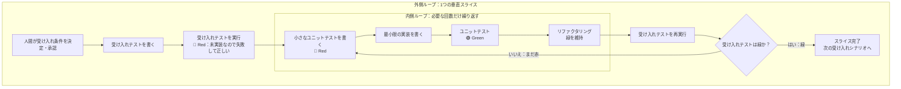

# AI時代の開発ドキュメント設計ガイド

> 2026年7月時点の調査と議論のまとめ
> テーマ：Codexでの開発に必要なドキュメント／ドキュメントとコードの役割／乖離の防ぎ方／テストと型

---

## 目次

1. [全体像](#1-全体像)
2. [Codexに必要なドキュメント](#2-codexに必要なドキュメント)
3. [ドキュメントの種類と粒度](#3-ドキュメントの種類と粒度)
4. [ドキュメントとコードの乖離問題](#4-ドキュメントとコードの乖離問題)
5. [人間とLLMの役割分担を問い直す](#5-人間とllmの役割分担を問い直す)
6. [共通言語としてのテストと型](#6-共通言語としてのテストと型)
7. [垂直スライスとTDD](#7-垂直スライスとtdd)
8. [議論の中で修正された誤解の一覧](#8-議論の中で修正された誤解の一覧)
9. [今後の開発へのアドバイス](#9-今後の開発へのアドバイス)
10. [参考文献](#10-参考文献)

---

## 1. 全体像

今回の議論は、次のように問いが深まっていきました。

```
「Codexにはどんなドキュメントが必要か？」
        ↓
「ドキュメントはどんな種類・粒度で置くべきか？」
        ↓
「ドキュメントとコードが乖離するのをどう防ぐか？」
        ↓
「そもそもドキュメントは誰のためのものか？人間とLLMの役割とは？」
        ↓
「人間とLLMの共通言語は何か？」 → テストと型
        ↓
「ではテストと型をどう作るか？」 → 垂直スライスとTDD
```

**最終的な結論を先に述べると、以下の3つです。**

> **① 検証できないドキュメントは書かない**
> **② 人間とLLMの共通言語は「散文」ではなく「検証可能な振る舞い」＝テストと型**
> **③ 理論（システムの本質的な理解）は人間の中にしか置けない。ドキュメントの目的は理論を外部化することではなく、理論を維持するコストを下げること**

---

## 2. Codexに必要なドキュメント

### 2.1 公式の整理

OpenAI Codexの公式ドキュメントでは、カスタマイズは以下のレイヤーの組み合わせと定義されています。

| レイヤー | 役割 |
|---|---|
| **AGENTS.md** | 永続的な指示（プロジェクト指針） |
| **Memories** | 過去の作業から学習した文脈 |
| **Skills** | 再利用可能なワークフローとドメイン専門知識 |
| **MCP** | 外部ツール・共有システムへのアクセス |
| **Subagents** | 専門化されたサブエージェントへの委譲 |

これらは競合するものではなく補完的なもので、**AGENTS.mdが振る舞いを形づくり、memoriesがローカルな文脈を前に運び、skillsが反復可能なプロセスを梱包し、MCPがローカルワークスペースの外のシステムに接続する**、と説明されています。

### 2.2 必須：`AGENTS.md`

Claude Codeの `CLAUDE.md` に相当します。**これだけは最初に置くべきファイル**です。

- Codexは作業を始める前にAGENTS.mdを読み込み、起動時に指示のチェーンを構築する（TUIではセッション起動ごとに1回）
- **小さく保つのが原則**

**書く内容**

- ビルド／テストコマンド
- レビュー時の期待
- リポジトリ固有の規約
- ディレクトリ固有の指示

**配置と優先順位（階層マージ）**

| レイヤー | パス | 用途 |
|---|---|---|
| グローバル | `~/.codex/AGENTS.md` | 個人の作業スタイル（応答の口調、冗長さ、既定ツール） |
| プロジェクト | リポジトリルートの `AGENTS.md` | チーム共通の規約（gitにコミット） |
| サブディレクトリ | `services/xxx/AGENTS.md` | パッケージ単位の上書き |
| 上書き専用 | `AGENTS.override.md` | 既存指示を強制的に差し替える場合 |

- マージ順はルートから下へ連結され、**カレントディレクトリに近いファイルほど後ろに来るため優先される**
- 1ディレクトリにつき1ファイルまで
- 空ファイルはスキップ
- 合計サイズが `project_doc_max_bytes`（既定 **32KiB**）に達すると打ち切られる

> ⚠️ **書きすぎ注意**：長大な仕様書や設計ドキュメントは別ファイルに分けてリンクする。ファイルが長くなるほど重要な指示が見落とされ、かえって精度が落ちる。

### 2.3 品質向上：`SKILL.md`（Skills）

**Claude Codeと同じ形式がそのまま使えます。**

- スキルは `SKILL.md` ＋ 任意の `scripts/` `references/` `assets/` を持つディレクトリ
- **Progressive disclosure（段階的開示）**
  1. まず `name` / `description` のメタデータだけで発見
  2. 選ばれた時に `SKILL.md` 本体を読む
  3. 必要になった時だけ references を読む／scripts を実行する
- 明示的な呼び出しに加え、タスクがdescriptionに合致すればCodexが自動選択する。**descriptionの明確さが発火精度を左右する**

**配置場所（公式表）**

| レイヤー | グローバル | リポジトリ |
|---|---|---|
| AGENTS | `~/.codex/AGENTS.md` | ルート／ネストの `AGENTS.md` |
| Skills | `$HOME/.agents/skills` | リポジトリ内 `.agents/skills` |

> ℹ️ 記事によっては `~/.codex/skills/` と書かれているものもある。バージョン差があるので、手元では `/skills` コマンドで認識されているか確認するのが確実。

### 2.4 その他の設定ファイル

| ファイル | 役割 |
|---|---|
| `~/.codex/config.toml` | モデル、承認モード、MCP設定 |
| `.codex/rules/*.rules` | サンドボックス外で実行できるコマンドを制御（実験的）。Starlark構文で `prefix_rule` を書き、`allow` / `prompt` / `forbidden` を指定 |
| `agents/openai.yaml` | スキルがMCPに依存する場合、その依存を宣言して自動接続させる |

### 2.5 導入順（公式の推奨ステップ）

```
① AGENTS.md でリポジトリの規約を守らせる
   ＋ pre-commitフック・linter・型チェッカーで機械的に強制する
        ↓
② 既存プラグインがあれば導入。なければSkillを作る
        ↓
③ 外部システムが必要ならMCP
        ↓
④ 専門タスクを任せる段階でSubagents
```

### 2.6 Claude Codeからの移行早見表

| Claude Code | Codex |
|---|---|
| `CLAUDE.md` | `AGENTS.md`（`~/.codex/AGENTS.md` ＋ リポジトリ内） |
| `~/.claude/skills/` の SKILL.md | `.agents/skills` / `$HOME/.agents/skills`（**フォーマットは同一**） |
| `settings.json` | `~/.codex/config.toml` |
| permissions設定 | `.rules` ファイル ＋ Permissions設定 |

SKILL.mdはAnthropic発の仕様が事実上のオープン標準になっており、**CodexでもClaude Codeでも無改変で動作します**。

---

## 3. ドキュメントの種類と粒度

### 3.1 Spec-Driven Development（SDD）の3段階

まず自分の立ち位置を決めます。martinfowler.com やプレプリント（arXiv:2602.00180）では、仕様運用の厳密さに応じて3段階が定義されています。

| 段階 | 内容 | Source of Truth | 向き先 |
|---|---|---|---|
| **Spec-first** | 実装前に仕様を書き、完成後は破棄 | コード | プロトタイプ、一度限りの開発 |
| **Spec-anchored** | 仕様をコードと共に進化させる「生きた文書」 | 仕様とコードの両方 | **ほとんどの本番システムに最適**（推奨） |
| **Spec-as-source** | 人は仕様のみ編集、コードは完全自動生成 | 仕様（コード編集禁止） | Simulink等のモデルベース開発 |

> 💡 **「うちはspec-anchoredでいく」と明示的に宣言してしまうのが最初の一手。** ここを曖昧にしたまま進むのが混乱の原因になる。

### 3.2 落とし穴①：「今のシステム全体の仕様」がどこにも無くなる

機能単位ドキュメントの最大の弱点です。

**実際に起きたこと**（サーバーワークスの事例）

```
サイクル1 → requirements.md      （コア機能）
サイクル2 → feature-b-requirements.md （新モジュール）

どちらも「仕様書」だが、スコープが違う。
個別の要件書は各サイクルの要求しかカバーしない。
        ↓
システム全体の現在の仕様を示すドキュメントがどこにもない
```

GitHub spec-kit の Discussion #152 でも「機能別に仕様書を作り履歴保持」派と「単一マスター仕様を維持」派が対立しており、複数仕様書があると**システムの現在の状態を理解するために複数の文書を読む必要が生じる**という認知負荷の問題が指摘されています。解決策として「仕様の圧縮」（複数の変更仕様を統合して現在の状態を示す単一仕様に変換）が提案されています。

**対策：ドキュメントを「正式版」と「履歴」に役割分離する**

| 区分 | 成果物 | 役割 |
|---|---|---|
| **正式版（現行仕様）** | 全体仕様（コードから再生成） | 毎サイクル上書き更新 |
| **履歴（意思決定記録）** | 機能ごとの要件書・設計書 | サイクル単位で不変保存。「なぜ作ったか」の記録 |

**参照先を決めておく**

| 質問 | 参照先 |
|---|---|
| 今のシステムは何ができるか？ | 全体仕様（正式版） |
| なぜこの機能を作ったか？ | 該当サイクルの requirements.md |
| どういう設計判断をしたか？ | 該当サイクルの design |
| 過去の仕様状態は？ | Git履歴 |

> ⚠️ **全体仕様を手で差分更新しないこと。** 上記事例でも差分更新ではなく毎回コードから全再生成する方式が選ばれた。理由は「全再生成の方がシンプルで乖離リスクがない」から。

### 3.3 落とし穴②：実装リストを恒久ドキュメントにしない

spec-kit では `specs/001-albums/spec.md`（何を作るか）→ `plan.md`（どう作るか）→ `tasks.md`（作業分解）という流れで、**機能ごとの番号付きフォルダに閉じ込められています**。

> **タスクリストは機能フォルダの中の使い捨て成果物であって、プロジェクト全体の恒久的な進捗表ではない。**

プロジェクト横断の「実装状況リスト」を1枚で持つと、更新漏れで必ず実態とズレます。**進捗の真実はコードとGitとIssueにあります。**

なお spec-kit には `analyze` という、実装前に全成果物の不整合・曖昧さ・カバレッジの穴を**読み取り専用で**レビューするステップがあります。憲法違反や論理的な穴を実行時エラーになる前に捕まえられると報告されています。

### 3.4 `constitution.md`（プロジェクト憲法）

spec-kit が導入した概念です。プロジェクトの**交渉不可能な原則**を1ファイルに書き、AIが計画やコードを生成するたびに「憲法チェック」を通します。

> ⚠️ **憲法が曖昧だとAIは検証できない。**
> - ✗「高品質なコードを書く」→ 検証不可能
> - ✓「APIレスポンス構造はJSON:API仕様に従う」→ 検証可能

Codexの文脈では、これは **AGENTS.md に統合してよい**層です。

### 3.5 ドキュメントを4層で考える

**「いつ読まれるか」で分類すると、種類と単位の迷いはほぼ解けます。**

| 層 | 何を書くか | 単位 | ファイル |
|---|---|---|---|
| **① 常時ロード** | 規約、ビルド/テストコマンド、禁止事項、参照先ルーティング | リポジトリ／ディレクトリ | `AGENTS.md` |
| **② オンデマンド（手順）** | 繰り返す作業手順（リリース、レビュー、テスト生成） | ワークフロー | `.agents/skills/*/SKILL.md` |
| **③ オンデマンド（知識）** | 現行の全体仕様、ドメインモデル、API契約、アーキテクチャ | サブシステム／境界づけられたコンテキスト | `docs/` 配下 |
| **④ 履歴** | なぜこう決めたか（要件・設計判断） | 機能／サイクル | `specs/NNN-feature/` |

**①は常にコンテキストを食うので極小に、③④はリンクで辿らせる。**

Codex公式も、エージェントが正しいファイルは見つけるが読みすぎている場合は**ルーティング指示（どのディレクトリ/ファイルを優先するか）を追加せよ**と明示しています。つまり **AGENTS.mdの重要な役割のひとつは「目次」** です。

### 3.6 推奨ディレクトリ構成（個人〜小規模開発）

```
repo/
├── AGENTS.md                 # ① 規約＋憲法＋docs/への目次（小さく保つ）
├── .agents/skills/           # ② 繰り返し手順
│   ├── commit/SKILL.md
│   └── release/SKILL.md
├── docs/
│   ├── architecture.md       # ③ 全体構成・技術判断（コードから再生成可）
│   ├── domain-model.md       # ③ 用語とデータモデル
│   └── adr/                  # ③ 重要な技術選定の記録（1決定=1ファイル、不変）
│       └── 0001-tauri-ipc.md
└── specs/
    └── 001-price-alert/      # ④ 機能単位・不変
        ├── spec.md           #    何を・なぜ
        ├── plan.md           #    どう作るか
        └── tasks.md          #    作業分解（実装完了後は履歴扱い）
```

---

## 4. ドキュメントとコードの乖離問題

### 4.1 問題の正体：静かに壊れるから価値がなくなる

arXiv:2606.27045（Spec Growth Engine）が、乖離の何が有害かを的確に言語化しています。

```
エージェントがコードを変更する
        ↓
誰も仕様を更新しない
        ↓
システムはテストに通る
        ↓
乖離は一度も検出されない
        ↓
仕様は「生きた契約」ではなく歴史的遺物になり、
以後のエージェントの実行は嘘に導かれる
```

**この失敗モードが特に厄介な理由：リンターも検出しない。CIも検出しない。乖離を抱えたまま出荷される。**

さらに、AIエージェントが毎分数百行を生成する時代には、**古い仕様による被害が従来開発よりはるかに速く蓄積します**。

> 💡 **ドキュメントの価値がゼロなのではなく、「検証されていないドキュメント」の価値がマイナス。** 無いよりも悪い。

### 4.2 「コードに価値がある」という直感は正しい

Thoughtworks は **実行可能なコードこそがsource of truthであり保守が必要**だと強調し、「仕様だけで十分」という見方を明確に否定しています。

Spec Growth Engine も、Tessl等が向かう spec-as-source 方向には**行かない**と明言しています。理由は MDA（モデル駆動開発）が抱えた非決定性を継承してしまうから。代わりに **「コードを主、仕様を検証済みの契約として扱う（code primary, spec verified）」** という立場を取っています。

> **議論の焦点は「ドキュメントとコード、どちらが偉いか」ではなく、「ドキュメントを何によって信頼できる状態に保つか」に移っている。**

### 4.3 解決策：規律ではなく機構で解く

Spec Growth Engine の設計思想は一貫しています。

> **エージェントの良い振る舞いに一切依存せず、ゲートで強制する。**

Spec Kit の弱点として「生成されるMarkdownの量が多い」ことと **「エージェントが詳細な指示をしばしば無視する」** ことが挙げられ、後者への対処が「散文でお願いするのではなくゲートで強制する」だと述べられています。

> ⚠️ **「仕様書を読ませても、その通りに実装してくれない」は既知の失敗モード。** プロンプトや文書の遵守に期待する設計が悪いのであって、書き方の問題ではない。

#### ① 仕様の更新をコードと同じコミットに強制する

中心的な不変条件はこれです。

> **同期を規律に委ねない——AIエージェントが影響を受けた仕様を同じコミット内で更新し、人間は契約レベルの変更だけをレビューする。**

これによって乖離は「社会的・プロセス的な問題」から **「構造的に不可能なこと」** に変わります。

```markdown
## AGENTS.md に書く実装ルール
- コードを変更したら、影響を受ける docs/ の記述を同じコミットで更新すること
- 更新が不要と判断した場合は、その理由をコミットメッセージに1行書くこと
```

「不要なら理由を書け」が効きます。判断を明示させることで無自覚なスキップが減ります。

#### ② 乖離を機械検出してマージをブロックする

**ドリフトゲート**は、仕様から導出した **Intent Graph** と、静的解析でコードから導出した **Evidence Graph** を突き合わせます。

**無条件にマージをブロックする硬性エラー**

- **オーファンコード**（仕様上の所有者がいないソースファイル）
- **未宣言の依存**（宣言されたエッジなしに仕様境界を越えてimportしている）
- **契約をバイパスした依存**（他ノードの内部ファイルを直接import）
- **依存先の契約が存在しない**

**ブロックしないが報告される警告**

- 宣言された依存にコード上の証拠がない
- publicなexportが契約に書かれていない
- 契約に書かれた振る舞いにテストの裏付けがない

Codexにも `hooks` や automations があり、公式ドキュメントも**定期的なドリフトチェックの自動化**（例：日次でガイダンスの抜けを探し、AGENTS.mdへの追記を提案させる）を推奨しています。

#### ③ 受け入れ条件を散文ではなくテストで書く

arXiv:2602.00180 は、従来の仕様が人間に読まれるだけなのに対し、**SDDの仕様はBDDシナリオ、APIコントラクトテスト、モデルシミュレーションとして実行され、コードが一致しなければビルドが落ちる**と整理しています。そしてCI/CDに仕様検証を組み込み、毎コミットでドリフトを即座に捕まえる、と。

```
✗ spec.md: 「価格は税込で表示し、端数は切り捨てる」
   → LLMが読み飛ばす。読み飛ばしても誰も気づかない。

✓ tests/pricing_test.go: assert(display(1234) == "1,357円")
   → LLMが読み飛ばしたら赤くなる。読み飛ばせない。
```

> **散文の仕様は「守ってくれたらいいな」。テストは「守らないと進めない」。**

#### ④ そもそも手で書くドキュメントを減らす

Spec Growth Engine の設計では、手で書くのは **ARCHITECTURE.md 1枚と、アーキテクチャノードごとのSPEC.md 1枚だけ**。**インデックス、依存グラフ、ドリフトレポートはすべて導出（derive）される——手で書くものは他に何もない**と明記されています。

> **腐るのは手書きの部分だけ。導出できるものは絶対に手で書かない。**

### 4.4 ゲートの正しい置き場所

| 誤り | 正しい |
|---|---|
| GitHubへのpush時に照合 | **PR/CIのマージ判定**に置く |
| 事後に照合するだけ | **同じコミットで仕様の差分を出させる**（規約）＋ **CIでの機械的照合**（網）の二段構え |

不変条件は「**仕様とコードは常に整合しているか、さもなくばコミットが着地しない**」です。

---

## 5. 人間とLLMの役割分担を問い直す

### 5.1 提起された仮説

> ドキュメント＝LLMが読むもの／コード＝人間が読むもの。
> これは設計者と実装者の関係ではないか？

**結論：この分業説には賛成しない。**理由は2つ、実証データと理論。

### 5.2 反論①：機械向け表現と人間向け表現は分岐しない

arXiv:2604.07502「Beyond Human-Readable」がこの問題を扱っています。

**まず、慣習ごとに評価が変わることは事実**

| 慣習 | 人間の理由 | エージェントの圧力 | 対応 |
|---|---|---|---|
| ファイル分割 | 作業記憶の限界（約7項目） | 1ファイル＝1ツールコールのコスト | **減らす** |
| 命名規約 | 可読性・自己文書化 | 名前＝LLMにとって圧縮されたドキュメント | **強化する** |
| 抽象化の深さ | 契約だけで推論できる | 儀式対ロジック比 8:1（Java） | **減らす** |
| ログ形式 | 人間がスキャンできる | 圧縮すると推論税が増える | **維持する** |
| コミットメッセージ | 端末でのスキャン用に短く | 詳細＝エージェントへの意味的文脈 | **強化する** |

**しかし、論文が最も確信度が高いと述べている結論はこれ**

> **人間と機械の双方にとって最適な表現は、高いセマンティック密度を共有する。** よく名付けられた関数、明確なドキュメント、意味のある構造は両者に利益をもたらす。**乖離するのは構造的な編成である**——人間は小さいファイルと視覚的な整形を必要とし、機械は統合されたアクセスとナビゲーション用の索引を必要とする。

**実験：圧縮のパラドックス**

ログを4形式でLLMに診断させた結果：

| 形式 | 入力トークン | セッション総トークン | 所要時間 |
|---|---|---|---|
| A 人間可読 | 8,072 | **18.9k** | **1分36秒** |
| B 構造化 | 7,106（-12.0%） | 24.0k | 5分24秒 |
| C 圧縮 | 6,695（**-17.1%**） | **31.6k（+67.2%）** | 7分00秒 |
| D C＋デコーダ | — | 28.3k | 4分05秒 |

**入力トークンを17%削減したのに、セッション総コストは67%増加した。**

原因は解釈の負担が推論フェーズに転嫁されたこと（**推論税**）。「注文#4521の決済失敗：残高不足」は即座に解釈可能だが、`|E|PS|pf|o=4521|rs=insuf_funds` はモデルが各略語をデコードし、その解読を出力で説明する必要がある。

> **「機械最適化」とは「圧縮された」という意味ではなく、「セマンティックに密である」という意味であり、それはしばしば人間可読性と一致する。**

**さらに、論文自身が挙げる制約**

> エージェント向けの最適化は**認知的負荷を人間のレビュアーに転嫁する**。ある慣習が最適であるのは、システム全体のコスト（エージェントの開発＋人間のレビュー）が最小化される場合に限られる。

**分業には見えない請求書がついてくる。**

### 5.3 反論②：「誰も理論を持たない」という深い問題

Peter Naur「Programming as Theory Building」(1985) がAIエージェント時代に再評価されています。

**Naurの主張**

- ソフトウェアエンジニアの中核的な産出物はプログラムそのものではなく、**そのプログラムがどう動くかの理論**である
- コードを持っているだけでは変更できない。まずコードを読み、メンタルモデル（＝理論）を構築する必要がある
- **「プログラムの本質的な一部である理論は、およそ表現しうるものではなく、人間に不可分に結びついている」**
- つまり **理論はドキュメントに書き切ることが原理的に不可能**（Naurの言葉では「厳密に不可能」）

**AIエージェント時代の帰結**

> エージェントがコードを書けば、人間は誰も理論を構築しない。コードベースは存在するが、**恒久的に「死んだ」状態**にある——修正するのではなく、再生成することでしか保守できない。

そして **AIエージェントはコードベースの理論を保持できず、毎回ゼロから構築しなおします。**

**分業モデルの危うさ**

```
人間の設計者：実装しないことによって、システムがどう動くかの理論を失う
LLM側      ：そもそも理論を保持できない
        ↓
システムの理論をどこにも持っていない体制になりうる
```

> ⚠️ **仕様とコードの乖離はCIで検出できるが、理論の喪失は検出できない。**

### 5.4 ファイル分割の正しい理解

「人間は分割、LLMは統合」は**おおむね合っているが、この言い方だと判断を誤ります**。正確には**コスト関数が違う**ということです。

| | コストの源泉 | 大きすぎると |
|---|---|---|
| 人間 | 作業記憶（約7項目） | 1ファイルを追えなくなる |
| LLM | ツールコール回数とコンテキスト充填 | 中央の情報への注意が落ちる |

**LLMも無制限に大きいファイルを好むわけではない**

- **Lost in the Middle**：中央に位置する情報の検索精度が落ちる（大きなファイルの復権に直接反する）
- **訓練分布のパラドックス**：統合ファイルやGod Objectのようなエージェント最適な構造は訓練データ中で過小に表現されているため、逸脱するとハルシネーションが増える可能性がある

**正しい定式化**

> **敵はファイル数ではなく「低い凝集度」。**
> ファイル分離は**デプロイ境界・テスト容易性・並行開発**によって駆動されるべきで、ファイルサイズに関する認知的限界によってではない。

論文は **1つの機能に関わるコードが一箇所にまとまる Vertical Slice アーキテクチャが、自然にエージェントフレンドリー**として浮上すると述べています。

**人間の可読性とLLMの効率は、「凝集度を上げる」という一点で両立します。** 対立するのは「1ファイル300行ルール」のような機械的な行数分割だけです。

### 5.5 LLMの「記憶力」についての正確な理解

| | LLM | 人間 |
|---|---|---|
| 1セッション内で保持できる量 | 圧倒的に多い | 7項目程度 |
| **セッションをまたいだ保持** | **ゼロ。毎回ゼロから** | 年単位で持続 |
| 中央部分の精度 | 落ちる（Lost in the Middle） | 落ちない |

> **LLMは瞬間記憶が桁違いに大きく、長期記憶が存在しない。**

この非対称性が実務で効きます。人間は「前に決めたよね」が通じますが、LLMには通じない。だから **AGENTS.md や CODEMAP.md は、LLMにとっての長期記憶の代替物**という位置づけになります。

### 5.6 目次と境界は別物

**2つの別々の失敗を防ぐ装置です。**

| 装置 | 防ぐ失敗 | 具体例 |
|---|---|---|
| **目次（索引）** | 必要な情報に辿り着けない | 「認証の仕様どこ？」で見つけられず、勝手に推測して実装する |
| **境界（契約）** | 辿り着いた後、止まれない | 認証の仕様を見つけた後、関連しそうなファイルを次々に開き、コンテキストが埋まり精度が落ちる |

> ⚠️ **後者が厄介なのは、「読みすぎている」ことが成功に見えるから。** ちゃんと調べているように見えるので人間が気づきにくい。

Codex公式が更新トリガーとして「正しいファイルは見つけるが、読む文書が多すぎる場合」を独立した項目として挙げているのは、これが目次の問題とは別物だからです。

Spec Growth Engine の文脈スコープはこうなっています。

```
エージェントに渡す文脈 =
    ルートの不変条件（ARCHITECTURE.md）
  + 所有パス上の契約（root → N）
  + 対象ノードNの仕様
  + Nの依存先の【契約のみ】（1ホップのみ、設計やコードではない）
  + Nが所有するコード

【除外されるもの】
  兄弟コンポーネント／依存先の設計／依存先のコード／
  推移的依存／その場しのぎのgrep結果
```

> **文脈が不十分だった場合の既定の修復は、文脈を広げることではなく、仕様グラフを直すこと。**

**AGENTS.mdへの落とし込み例**

```markdown
## 目次（どこにあるか）
- 価格計算のロジック → src/pricing/
- 外部APIの契約 → docs/api-contracts.md

## 境界（それ以上読まない指示）
- src/pricing/ の作業では、src/ui/ は読まないこと
- 他モジュールを使う場合は、その公開インターフェースのみ参照し、
  内部実装は読まないこと
- 上記で情報が足りない場合は、探索を広げず、
  「契約が不足している」と報告して停止すること
```

最後の1行が肝です。**LLMに探索させるのではなく、探索を止めさせる。** そして「1ホップで足りなかった」という報告は、そのままアーキテクチャの改善点を教えてくれます。

---

## 6. 共通言語としてのテストと型

### 6.1 共通言語が満たすべき3条件

| 条件 | 意味 |
|---|---|
| **① 双方が読める** | 人間の可読性を捨てない |
| **② 嘘をつけない** | 実行可能で、乖離したら壊れる |
| **③ 小さい** | 人間の作業記憶にもコンテキストウィンドウにも収まる |

- **散文のドキュメント**：①③は満たすが、**②を決定的に満たさない** → だから腐る
- **コード**：②と（原理的には）①を満たすが、規模が大きくなると③を満たさない
- **テストと型**：**3つすべてを満たす**

### 6.2 テストは理論を反映するか

**「理論の一部を投影したもの」であって、理論そのものではない。**

Naurの読解のひとつが警告しています。理論がどこに宿るかを問うたとき、答えが「ドキュメントの中」や「テストの中」なら、それは**部分的な答えでしかない**。

**理論の3層**

| 層 | 内容 | テストで表現できるか |
|---|---|---|
| **何を約束するか** | この入力にはこう応答する | ◎ そのまま書ける |
| **なぜそう設計したか** | なぜこの境界で切ったか、何を捨てたか | ✗ 書けない → ADR/コミットメッセージへ |
| **次に何が起こりうるか** | どこが変わりやすいか、どこが危ういか | ✗ **書き切れない** |

#### 最も危険な罠：書かれた順序

```
✓ 理論 → テスト → 実装
   テストは「約束」を書いている。実装が外れたら赤くなる。

✗ 実装 → テスト
   テストは「現状」を書いている。実装が間違っていても緑になる。
```

> ⚠️ **LLM開発で頻発するのは後者。** エージェントに実装させた後で「テストも書いて」と頼むと、**コードを読んでコードと一致するテストを生成する**。これは検証ではなく**トートロジー**で、通って当然。カバレッジは上がるので安心感だけが増え、乖離を固定する装置になる。

**運用ルール**

- **受け入れ条件のテストは、実装前に人間が確定させる**
- **回帰テストは実装後にLLMに大量生成させてよい**（現状の固定が目的なのでトートロジーで正しい）

#### 受け入れテストの価値と、人間が握るべきもの

AIに実装を任せる開発では、受け入れテストの価値が特に高い。受け入れテストは、AIの実装とは独立した**「何をもって完成・正解とするか」**を与える判定基準だからである。

ただし、**「人間が受け入れテストを作る」＝「人間がテストコードを一字一句手書きする」ではない。** 人間が手放してはいけないのは、テストコードの入力作業ではなく、要求・業務ルール・期待値の**決定と承認**である。

| 作業 | 主な担当 | 手放してよいか | 理由 |
|---|---|---|---|
| 何を実現するかを決める | **人間** | ✗ | 目的や価値は実装コードから導出できない |
| 入力・期待値・境界条件を決める | **人間** | ✗ | ここが「正しい」の定義になる |
| 受け入れテストのコードへ変換する | LLMでもよい | ○ | 機械的な記述は委譲できる |
| 生成されたテストをレビューし確定する | **人間** | ✗ | 要求を正しく表しているかの最終判断が必要 |
| 確定したテストを満たすよう実装する | LLMに任せてよい | ○ | 独立した合格条件の下で自己修復できる |

**望ましい流れ**

```
人間の意図・業務ルール
        ↓
人間が入力・期待値・境界条件を決定
        ↓
LLMが受け入れテストのコードを起草してもよい
        ↓
人間がレビューして合格条件を確定
        ↓
LLMが実装
        ↓
確定済みテストで検証
```

**避けるべき流れ**

```
LLMが実装
   ↓
同じLLMが実装を読んで期待値を決定
   ↓
同じLLMがテストを作成
   ↓
自分で作った採点基準に自分の実装が合格する
```

たとえば、本来の業務ルールが「会員価格は20%引き」であるのに、実装が誤って10%引きになっているとする。実装を根拠に `1,000円 → 900円` というテストを作れば、そのテストは通る。しかし確認できるのは**「実装とテストが一致すること」**だけで、**「20%引きという意図と一致すること」**ではない。

```
本来の仕様：1,000円 → 800円
                    │ 乖離
間違った実装：1,000円 → 900円
                    ↓ 実装から期待値をコピー
間違ったテスト：期待値 900円 → 緑
```

このテストはカバレッジを上げる一方、後から実装を正しい800円に直すと赤くなる。その結果、**誤った現状が「守るべき仕様」に見えてしまう**。これが「乖離を固定する装置」という意味である。

人間が受け入れテストを確定するときは、最低限、次を確認する。

- テスト名が利用者や業務の言葉で要求を表しているか
- 入力と期待値の根拠を、実装コードではなく要求から説明できるか
- 正常系だけでなく、重要な境界値・異常系が含まれているか
- 内部の関数構成ではなく、外から観測できる振る舞いを検証しているか
- このテストが通れば、そのスライスを完成と判断できるか

> 🔑 **誰がテストコードを入力したかではなく、誰が「正解」を決め、その期待値を何から導いたかが重要。** LLMに起草させても、人間の意図から独立した合格条件として人間が確定すれば、受け入れテストは検証として機能する。

なお、受け入れテストだけですべての品質を保証するわけではない。**受け入れテストは「作るべきものが正しいか」**、ユニットテストは内部ロジック、回帰テストは既存動作の維持、型は不正な状態の排除をそれぞれ担当する。受け入れテストの価値が高いことは、他の検証手段が不要という意味ではない。

#### テストはドメインの言葉で書く

```go
// ✗ 実装の言葉。人間は意図を読み取れない
func TestCalculate(t *testing.T) { ... }

// ✓ ドメインの言葉。仕様として読める
func Test_同一商品が複数出品されている場合_最安値を採用する(t *testing.T) { ... }
func Test_送料込み価格が不明な出品は_比較対象から除外する(t *testing.T) { ... }
```

下は**人間が読んで意図を確認でき、LLMが読んで実装方針にでき、外れたら赤くなる**。3条件を全部満たします。

### 6.3 型とは何か

**データモデリングとは重なるが、狙いが違う。**

| | 記述するもの |
|---|---|
| **データモデリング** | どういうデータが**存在しうるか** |
| **型設計** | どういうデータが**存在してはいけないか**を、コンパイラに強制させる |

キーワードは **"Make illegal states unrepresentable"（不正な状態を表現不可能にする）**。データモデリングが「箱を用意する」ことなら、型設計は**「間違った箱を作れなくする」**ことです。

#### 例1：意味のない `string` を追放する

```go
// ✗ どちらもstring。引数の順番を入れ替えてもコンパイルが通る
func Transfer(fromUserID string, toUserID string, amount int) error

// ✓ 別の型なので、取り違えるとコンパイルエラー
type UserID string
type Yen int64
func Transfer(from UserID, to UserID, amount Yen) error
```

**LLMが引数を取り違える事故がゼロになります。** 散文で「第1引数は送金元です」と書くより確実。

#### 例2：状態遷移を型で表す（本丸）

```typescript
// ✗ ありえない組み合わせが表現できてしまう
type FetchState = {
  loading: boolean;
  data?: Item[];
  error?: string;
};
// loading:true かつ error:"..." かつ data:[...] という状態が作れてしまう

// ✓ 3つの状態しか存在しえない
type FetchState =
  | { status: "loading" }
  | { status: "success"; data: Item[] }
  | { status: "error"; message: string };
```

**「ローディング中はデータがない」という仕様が、ドキュメントではなく型として書かれている。** 腐ったらビルドが落ちるので腐りません。

Rustならこれが `enum` の本業です。

```rust
enum Listing {
    Draft { title: String },
    Published { title: String, price: Yen, published_at: DateTime<Utc> },
    Sold { title: String, sold_price: Yen },
}
```

「下書きには価格がない」「売却済みには売却価格が必ずある」が全部型に出ており、仕様書に書く必要がありません。

#### 例3：「無いかもしれない」を型に出す

```rust
fn find_lowest_price(items: &[Listing]) -> Option<Yen>
```

戻り値を見た瞬間に「見つからない場合がある」と分かり、**呼び出し側は必ずその分岐を書かされます**。Goの `(T, error)` も同じ思想。

#### 例4：検証済みであることを型で保証する

```rust
struct RawInput(String);
struct ValidatedTitle(String);   // 生成できるのはvalidate関数だけ

fn validate(raw: RawInput) -> Result<ValidatedTitle, ValidationError>
fn publish(title: ValidatedTitle)   // 未検証の値は物理的に渡せない
```

**「publishの前に必ずvalidateすること」という規約を、規約ではなく型で書いている。** LLMが手順を飛ばそうとしてもコンパイルが通りません。

#### なぜ型が共通言語として強いのか

| 条件 | 型が満たす理由 |
|---|---|
| 双方が読める | シグネチャは人間にもLLMにも最も密度の高い要約 |
| 嘘をつけない | コンパイラが強制する。**テストは書き忘れられるが、型からは逃げられない** |
| 小さい | 実装本体を読まずにシグネチャだけで契約が分かる＝1ホップで済む |

さらに **フィードバックが即時**。エージェントが型を無視すると、テスト実行を待たずコンパイル時点で落ち、**エージェントは自分でそれを直せる**。散文の仕様書にはこの性質が一切ありません。

#### 型の限界

- **「なぜ」を語れない** → ADR/コミットメッセージへ
- **表現力に上限がある**。「送料込み価格は本体価格の3倍を超えない」のような業務ルールは型で表現しきれない → テストの仕事
- **やりすぎると読めなくなる**。型パズルはセマンティック密度をむしろ下げる

### 6.4 腐るものと腐らないものの一覧

| 何を | どこに書くか | 腐るか |
|---|---|---|
| どういう状態が存在しうるか | **型** | 腐らない（ビルドが落ちる） |
| どう振る舞うと約束したか | **テスト**（実装前に確定） | 腐らない（赤くなる） |
| なぜそう決めたか | ADR / コミットメッセージ | 腐らない（過去は変わらない） |
| どこに何があるか | AGENTS.md / CODEMAP.md | 腐る → **導出する** |
| 現在の全体像 | docs/architecture.md | 腐る → **再生成する** |

> **上3つは書いた瞬間から腐らない性質を持っている。下2つだけが腐るので、そこだけ機械に再生成させる。**
> 乖離の原因は「**乖離しうる形式で書きすぎていた**」こと。型とテストに移せるものを全部移せば、残る散文は驚くほど少なくなる。少なければ維持できる。

### 6.5 プログラムスケルトン（CODEMAP.md）

arXiv:2604.07502 が提案する、エージェント消費向けの新しい成果物カテゴリ。

| 含むもの | 省くもの |
|---|---|
| モジュールのトポロジ | 実装本体 |
| エントリポイント | import |
| 一行説明つきの呼び出し連鎖 | 構造的ボイラープレート |
| docstring付き関数シグネチャ | フレームワークの儀式 |
| データフロー要約／ファイル位置 | |

**ASTではなく、ナビゲーションを保存する非可逆なセマンティック圧縮。** LSPが動的な個別クエリを提供するのに対し、スケルトンは1回の読み込みで一括のオリエンテーションを提供する（両者は補完的）。

コードから導出可能なので腐りにくく、人間にとっても普通に読める **共通言語の良い例**です。

---

## 7. 垂直スライスとTDD

### 7.1 理論は事前に完成しない

> ❌ **「理論を完成させてから、テストを書き、実装する」はウォーターフォールに戻ってしまう。**

Naurに戻ると、**理論は作ることによってしか構築されない**。「理論が事前に完成しうる」という前提が成り立つのは、すでに何度も作ったことのあるシステムだけです。

### 7.2 二層ルール（Spec Growth Engine）

**層1：不変条件は事前に、意図的に決める**

> ルートの不変条件と主要なコンテナ境界（**永続化、セキュリティ、外部連携、エラー分類**）は、いかなる機能よりも先に仕様化される。これらは just-in-time では**ない**。アーキテクチャがそれ以下に静かに侵食されえない**床**を形成する。

**層2：機能は必要になった時に、その都度**

> それ以外はすべて機能の垂直スライスとして成長し、**難所を先に**並べる。スライス#1は最もリスクの高い統合を貫く「曳光弾」。

**両極端はどちらも失敗する**

| 失敗パターン | 何が起きるか |
|---|---|
| **純粋アジャイル（床がない）** | どの機能も永続化を強制しなかったため、**商品リストがデータベースではなく312行のハードコード配列になった**。どの一歩も間違っていなかったのに、境界が現れる機会が一度もなかった |
| **幅優先の偽装** | 難しい問題がスタブに隠れ、最後になって表面化する |

**実際の適用**

```
【最初に一度だけ、意図的に】
  - データの永続化方式（型・スキーマの基本形）
  - エラーの分類方針（Result/Option をどう使うか）
  - 外部連携の境界（どこがIOで、どこが純粋か）
  - セキュリティの前提
  → 型で書く。ARCHITECTURE.md に理由を書く。

【機能ごとに、都度】
  - 最もリスクの高い経路から1本、端から端まで「本物で」通す
  - その過程で理論が育つ
  - 育った理論を、受け入れテストと型に固定する
  - 次のスライスへ
```

> **「理論 → テスト → 実装」の順序は正しいが、理論の単位は「システム全体」ではなく「1スライス」。**
> 1スライスぶんの理論なら実装前に固められる。システム全体の理論は、スライスを積み重ねた結果として**事後的に**立ち上がる。

### 7.3 垂直スライスとは何か

**「1機能」よりも薄いもの。**

> 垂直スライスとは、システムを貫く薄い、端から端まで機能する増分——**必要なすべてのアーキテクチャ層に触れるが、必要な部分だけに触れる**もの。

```
        機能「価格追跡」（横に広い）
    ┌─────────────────────────────┐
UI  │ ███                          │
    ├─────────────────────────────┤
ロジック│ ███                        │
    ├─────────────────────────────┤
永続化 │ ███                         │
    ├─────────────────────────────┤
外部API│ ███                        │
    └─────────────────────────────┘
        ↑
    スライス#1（縦に細い）
    「1商品の価格を1回取得してDBに保存し、画面に1行表示する」
```

スライス#1がやるのは**それだけ**。複数商品も、履歴も、グラフも、エラーリトライも、通知もない。でも**外部API→パース→DB保存→画面表示まで、全部本物で通っている**。

**偽装（fake）が許されるのは境界（次のスライスが担当する依存先）のみで、現在のスライスの実行経路上では決して許されない。**

```
✗ よくある進め方（横に積む）
  1. UIを全部作る（データはモック）
  2. ロジックを全部作る
  3. DBを繋ぐ ← ここで初めて「外部APIが想定と違う」が発覚。作り直し

✓ スライス（縦に通す）
  1. 1商品ぶんだけ、外部API→DB→画面を本物で貫通 ← 難所が初日に判明
  2. 商品を複数対応にする
  3. 履歴を追加する
```

> **スライスは理論を育てる装置。** スライス#1を通した時点で、そのシステムの一番難しい部分についての理論を持っている（外部APIが何を返すか、どこが遅いか、どこがエラーになるか）。**これは実装してみないと絶対に分からない。**

### 7.4 TDDとは何か

**TDDは「AIに正確な実装をさせる手法」でもあるが、それだけではない。** Kent Beckが提唱したときの主眼は、正しさの検証ではなく**設計手法**でした。

| | 理論を反映するか | 主な役割 |
|---|---|---|
| **テストを先に書くという行為** | ◎ | **設計行為**。「この機能の外から見た約束は何か」を、実装の都合抜きで決めさせられる |
| **書かれたテストという成果物** | ○（受入テストのみ） | 検証装置 |
| **ユニット/回帰テスト** | ✗ | 純粋に堅牢性のため |

**なぜ行為が設計になるか**：テストを先に書くと**必ず「使う側」から書き始めることになる**。

```go
// テストを先に書くと、まずこう書く。これは設計判断そのもの
result, err := pricing.LowestPrice(listings)
```

この1行で「関数名は何か」「何を受け取るか」「見つからない場合はどう返すか」を決めている。実装から書くと、この判断は**実装の都合（DBの都合、ライブラリの都合）に引きずられる**。テストから書くと**呼び出し側の都合＝ドメインの都合**で決まる。

**AI時代における追加の効能**

Kent Beck自身が、TDDとAIエージェントの組み合わせを **"superpower"** と呼んでいます。

> テストを先に書けばAIが1行も実装する前に「正しい」の定義が確定する。エージェントは**自分の壊れたロジックを検証するテストを書くことでごまかせない**し、**失敗を消すためにアサーションを静かに削除することもできない**。

さらに Beck は、**このサイクルがないとAIが生成した複雑性が蓄積し、やがてエージェントが完全に停止する**とも述べています。研究側でも **テストケースは曖昧さを減らし実行可能な仕様として機能することで性能を向上させる**という結果が出ています。

**ただし懐疑論も存在する**

- 「AIが高速にコードを生成するなら仕様に固定すべきだ」という理屈は一見もっともらしいが、**厳格なTDDがエージェント型AIと出会ったとき実際に何が起きるかを見ると、通説より複雑で厄介**という指摘
- TDDは開発者が設計意図と詳細なテストロジックの両方を維持しなければならず、**導入期には生産性を下げる**という古典的研究

### 7.5 受け入れテストとTDDのDouble Loop

Double Loopでは、**外側のループが「何を作るか」**、**内側のループが「どう作るか」**を担当する。

| ループ | 主なテスト | 単位 | 役割 | 完了条件 |
|---|---|---|---|---|
| **外側** | 受け入れテスト | 1つの垂直スライス | 利用者から見た約束と完成条件を固定する | 受け入れテストが緑になる |
| **内側** | ユニットテスト | 1つの小さな振る舞い | 実装を小さく設計・検証しながら育てる | 対象のユニットテストが緑になる |

#### 最初の受け入れテストは、赤であることが正しい

ここで最も誤解しやすいのは、**「受け入れテストが通らないと内側へ進めない」のではない**という点である。正しくは次のとおり。

> **受け入れ条件が確定していないと内側へ進めない。受け入れテストは失敗しているからこそ、その失敗を解消するために内側へ進む。**

| タイミング | 受け入れテストに求める状態 | ゲートの意味 |
|---|---|---|
| **内側へ入る前** | 内容が人間によって確定し、実行すると**赤**になる | **入口の条件**：「何をもって正解とするか」が決まっている |
| **スライスを終える前** | 実行すると**緑**になる | **出口の条件**：約束した振る舞いが実現されている |

したがって、受け入れテストは内側へ進む前に「通す」ものではない。**「これを通せば完成」と確定し、赤い状態で内側のループへ渡すもの**である。



このフローで守るべき原則は次の3つ。

- **赤い受け入れテストを消したり、実装に合わせて期待値を変えたりしない**
- 内側では一度に全部を実装せず、**小さなRed-Green-Refactor**を繰り返す
- 外側が緑になった時点で、そのスライスを完成と判断し、次のシナリオへ進む

**具体例**

```go
// ────── ① 受け入れテスト（最初に書く。長く赤いまま）──────
func Test_商品URLを登録すると_現在価格が表示される(t *testing.T) {
    app := setupApp(t)                      // 本物のDB、外部APIはテスト用サーバ
    app.RegisterProduct("https://...")
    app.Refresh()
    assert.Equal(t, "¥3,980", app.View().Rows[0].Price)
}
// → 赤。当たり前。まだ何もない。

// ────── ② 内側ループを何周も回す ──────
func Test_HTML内の価格表記をパースできる(t *testing.T) { ... }      // 赤→緑
func Test_カンマ区切りの価格を数値に変換する(t *testing.T) { ... }   // 赤→緑
func Test_価格が見つからない場合はエラーを返す(t *testing.T) { ... } // 赤→緑
func Test_取得した価格をDBに保存できる(t *testing.T) { ... }        // 赤→緑

// ────── ⑤ ここで受け入れテストが緑になる。スライス#1 完了 ──────
```

この例では、外側のテストが「商品URLの登録から価格表示まで」という**利用者に見える約束**を表す。内側のテストは、パース、数値変換、異常系、DB保存という**約束を実現するための内部の振る舞い**を一つずつ作る。内側のテストが個別に緑でも、外側が赤い間はスライス未完成である。

#### ウォーターフォールと似ている点・異なる点

Double Loopがウォーターフォールに似て見えるのは自然である。どちらも、**要求を決めてから設計・実装し、合格条件で検証する**。TDDは「設計せず、とりあえずコードを書く」方法ではない。

違いは工程名ではなく、主に**一度に扱う範囲とフィードバックの速さ**にある。

| 観点 | ウォーターフォール的な一括フロー | Double Loop |
|---|---|---|
| 要求・設計の単位 | システム全体、または大機能 | **1つの小さな垂直スライス** |
| テストを置く時期 | 実装後にまとめて | **実装前に受け入れテストを置く** |
| 設計の進め方 | 前工程で広く決める | 内側のループで必要な分だけ育てる |
| フィードバック | 数週間〜数か月後になりやすい | 数分〜数時間で得る |
| 誤解した場合の影響 | 広い範囲の手戻り | そのスライス内に限定しやすい |
| 完成判定 | 最後にまとめて行う | スライスごとに受け入れテストで行う |

```
ウォーターフォール的な一括フロー
  全体の要件 → 全体の設計 → 全体の実装 → 全体のテスト

Double Loop
  小さな要求 → 受け入れテスト → 小さな設計・実装・検証 → 次の小さな要求
```

> 💡 Double Loopは、**「要求 → 設計 → 実装 → 検証」を1スライスに縮め、短いフィードバックを得ながら何度も回すもの**と捉えると理解しやすい。ただし、システム全体の理論を最初に完成させるのではなく、各スライスから得た知識を次のスライスへ反映して理論を育てる点が異なる。

**AIエージェントとの分担**

| ステップ | 誰が |
|---|---|
| ① 受け入れテストを書く | **自分が決める**（LLMに書かせてレビューして確定でもよい） |
| ② 内側ループ | **LLMに丸ごと回させる**。「この受け入れテストを緑にして」と渡す |
| ⑤ 緑になったら | **自分が差分と受け入れテストをレビュー** |

> **①だけは手放さない。** ここが理論であり、AIの成果物を判定する唯一の基準。②は完全に任せてよい（赤いテストがあるとエージェントは自己修復ループを回せるので、一番AIが強い領域）。

個人開発の規模なら、**統合テストと受け入れテストを厳密に分ける必要はありません**。「外部APIとDBを本物で通すテスト」が1種類あれば実質足ります。

### 7.6 粒度と範囲は別物

| 用語 | 意味 |
|---|---|
| **粒度** | 1サイクルをどれだけ小さく回すか（**時間軸**の話） |
| **範囲** | そもそも何をテストするか／しないか（**対象**の話） |

**厳密なRed-Green-Refactorを全レベルで回す必要はありません。層で分けるのが現実的です。**

| 層 | 誰が書くか | 順序 | 理論を持つか |
|---|---|---|---|
| **受け入れテスト**（機能の外向きの振る舞い） | **人間が確定させる** | 実装**前** | ◎ ここが本体 |
| **ユニットテスト**（内部ロジック） | LLMに書かせてよい | 実装と同時でよい | △ |
| **回帰テスト**（現状固定） | LLMに大量生成させる | 実装**後** | ✗ 持たなくてよい |

### 7.7 テストの優先順位

**判断基準は1つだけ。**

> **壊れたときに、気づけるか？**
> 気づけるものはテスト不要。気づけないものはテスト必須。

**最優先：静かに壊れるもの**

- **金額・数量・日時の計算**（1円ずれても画面は普通に表示される。誰も気づかない）
- **データ変換・パース**（形式が変わっても例外は出ず、間違った値が入る）
- **永続化の往復**（保存して読み戻すと値が変わる、型が変わる、タイムゾーンがずれる）
- **境界値と異常系**（空配列、0件、null、最大値。**LLMが最も落とすところ**）

**次点：分岐が多くて人間が全部追えないもの**

- 条件分岐が3つ以上あるロジック
- 状態遷移（型で表現しきれなかった部分）

**その次：外部との契約**

- 自分が公開しているAPI・インターフェース
- 外部APIのレスポンス形式に対する前提

**そして：バグが出た箇所**

- 修正する**前に**、そのバグを再現する失敗テストを書く
- **最も費用対効果が高い**。実際に壊れた場所は、また壊れる

**逆に、書かなくていいもの**

- 画面に出るので壊れたら一目で分かるもの（レイアウト、色、文言）
- フレームワークやライブラリの動作（向こうがテストしている）
- getter/setter、単純な委譲
- **型で保証済みのこと**（`Option<T>` を返す関数に「nilを返さないこと」のテストは不要）

> 💡 **型を効かせるほどテストの必要量は減る。**

### 7.8 テストと型は「変えにくい」のか

**変えにくさは「型かどうか」で決まるのではなく、「誰から見えているか」で決まります。**

> **権限は影響半径と可逆性に従う。** 外向きの表面（ルート不変条件、構造、公開契約）への変更は影響半径が大きく可逆性が低いためゲートを必要とする。内向きの表面（内部設計、所有するコード）への変更は局所的かつ可逆的であるため、自律的に行ってよい。

| ゲート | 対象 | 変更の重さ |
|---|---|---|
| **HARD** | ルート不変条件の変更、新しいコンテナ境界、破壊的な契約変更 | **人間の承認が必須** |
| **SOFT** | 新しいコンポーネント境界、追加的な契約変更 | エージェントが進めてよい。人間には非同期で通知 |
| **AUTO** | 内部設計、所有ノード内の純粋なリファクタリング | 人間なし |

```rust
// ✋ HARD：公開API。変えると全呼び出し元が壊れる。データモデルと同じ重さ
pub struct Listing { ... }
pub fn publish(l: Listing) -> Result<PublishedId, PublishError>

// 🆗 AUTO：モジュール内部。いくらでも変えていい
struct PriceCache { ... }
```

**内部の型は、むしろどんどん変えるべきもの。** 「型を書くと固まってしまう」という懸念は、**公開してしまった型についてだけ正しい**。

テストも同様です。

```go
// ✓ 変わらないでほしい約束。守るべき変えにくさ
Test_同一商品が複数出品されている場合_最安値を採用する

// ✗ 内部実装の写し。ただの負債。リファクタのたびに直す羽目になる
Test_priceCache_の_get_が_nil_を返すこと
```

| | 変えにくくすべきか | 理由 |
|---|---|---|
| 公開API・データモデル・不変条件 | **する（HARD）** | 影響半径が大きく、不可逆 |
| 内部の型・構造 | **しない（AUTO）** | 局所的で可逆。むしろ育てる |
| 受け入れテスト | **する** | 約束だから。頻繁に変わるなら仕様の問題 |
| 内部実装のテスト | **しない**（書きすぎない） | リファクタリングの敵になる |

> 🔑 **この境界の引き方が、そのまま「LLMにどこまで自律的にやらせてよいか」の境界と一致する。**
> AUTO領域はエージェントに任せ、HARD領域は人間が握る。**アーキテクチャの設計が、そのまま協業の設計になっている。**

---

## 8. 議論の中で修正された誤解の一覧

| # | 当初の認識 | 修正後 |
|---|---|---|
| **1** | 機能ごとの仕様書＋実装リストで十分 | 方向は正しい（＝SDD）。ただし**「今のシステム全体の仕様」が消える**問題と**実装リストが腐る**問題が構造的に発生する |
| **2** | 実装リストで進捗を管理する | タスクリストは**機能フォルダ内の使い捨て成果物**。進捗の真実はコード・Git・Issueにある。**進捗はテストの色で見る** |
| **3** | ドキュメントよりコードに価値がある | **その立場は正しい**（研究側の到達点も code primary）。ただし正確には「ドキュメントの価値が低い」のではなく「**検証されていないドキュメントの価値がマイナス**」 |
| **4** | ドキュメント＝LLM用、コード＝人間用（設計者と実装者の関係） | **賛成しない。** ①実験的に「人間と機械の最適表現は高いセマンティック密度を共有する」（圧縮のパラドックス：入力-17%でセッション+67%）。②Naur：**エージェントが書けば誰も理論を構築せず、コードベースは「死んだ」状態になる** |
| **5** | 機械向け＝圧縮すればよい | **「機械最適化」＝「セマンティックに密」であって「圧縮」ではない。** 圧縮すると推論税が発生して総コストが増える |
| **6** | 人間は分割、LLMは統合 | **コスト関数が違うだけ。** LLMもLost in the Middleと訓練分布のパラドックスがある。**敵はファイル数ではなく低い凝集度**。Vertical Sliceで両立する |
| **7** | LLMの方が記憶力が良い | **半分正しい。** 瞬間記憶は桁違いに大きいが、**長期記憶はゼロ**（毎回ゼロから構築）。だからAGENTS.mdが長期記憶の代替になる |
| **8** | 目次を示せば十分 | 目次は「**見つけられない**」を防ぐ。もう一つ「**読みすぎ**」を防ぐ**境界**が必要。**文脈が足りないときの修復は、文脈を広げることではなく境界を直すこと** |
| **9** | ゲートはGitHubへのアップロード時 | **PR/CIのマージ判定**に置く。さらに**同一コミットでの仕様更新**（規約）＋**CIでの機械照合**（網）の二段構え |
| **10** | TDDは設計者の理論を反映するもの | **半分正しいが不正確。** 「テストを先に書く**行為**」は設計行為＝理論構築そのもの。「書かれたテストという**成果物**」は理論の一部の投影にすぎない（**理論はドキュメントに書き切ることが原理的に不可能**） |
| **11** | TDD＝AIに正確な実装をさせる手法 | **行きすぎ。** Kent Beckの主眼はもともと**設計手法**。AI時代の効能は追加であって、設計手法としての側面が本体 |
| **12** | 理論が完成してからテストと型を作る | **❌ ウォーターフォールに戻る。** 理論は作ることでしか構築されない。**二層ルール**（不変条件は事前、機能はスライスごとに都度）で解く。**理論の単位はシステム全体ではなく1スライス** |
| **13** | 1スライス＝1機能 | **スライスは機能より薄い。** 機能は横に広く、スライスは縦に細い。**必要な全層に触れるが、必要な部分だけに触れる。難所を先に、本物で通す** |
| **14** | 粒度＝テスト範囲 | **別物。** 粒度＝1サイクルの小ささ（時間軸）、範囲＝何をテストするか（対象）。範囲の判断基準は「**壊れたときに気づけるか**」 |
| **15** | テストと型は簡単に変えられない | **形式ではなく「誰から見えているか」で決まる。** 公開契約はHARD（意図的に固く）、内部はAUTO（むしろ育てる）。内部実装に密結合したテストは**ただの負債** |

---

## 9. 今後の開発へのアドバイス

### 9.1 3つの開発原則（再掲）

> **① 双方が読める**（人間の可読性を捨てない）
> **② 嘘をつけない**（実行可能で、乖離したら壊れる）
> **③ 小さい**（人間の作業記憶にもコンテキストウィンドウにも収まる）

**この3条件を同時に満たすのは、テストと型。** 散文のドキュメントは②を満たさない。

### 9.2 何を書き、何を書かないか

```
【書く】
  ✓ 型      — どういう状態が存在しうるか／してはいけないか
  ✓ 受入テスト — どう振る舞うと約束したか（実装前に確定）
  ✓ ADR/コミット — なぜそう決めたか
  ✓ AGENTS.md  — 規約＋目次＋境界（小さく）

【導出する（手で書かない）】
  ⚙ docs/architecture.md — コードから再生成
  ⚙ CODEMAP.md          — コードから導出
  ⚙ 依存グラフ・索引     — 生成

【書かない】
  ✗ 検証手段を用意できないドキュメント
  ✗ プロジェクト横断の恒久的な実装状況リスト
  ✗ 型やテストで表現できることの散文による重複
```

> 🔑 **判断基準：検証手段を用意できないドキュメントは書かない。**

### 9.3 段階的な導入ロードマップ

**第0段階：立ち位置を宣言する**

- 「うちはspec-anchoredでいく」とAGENTS.mdに書く
- 「正式な仕様はどこか」を決める（docs/architecture.md ＝ 正式版、specs/ ＝ 履歴）

**第1段階：AGENTS.mdに3行足す（5分）**

```markdown
## 実装ルール
- コードを変更したら、影響を受ける docs/ の記述を同じコミットで更新すること
- 更新が不要と判断した場合は、その理由をコミットメッセージに1行書くこと
- 情報が足りない場合は、探索を広げず「契約が不足している」と報告して停止すること
```

**第2段階：TDDの入口（バグ修正から）**

- 既存コードで、**バグが出たときだけ**先にテストを書く
- 「何をテストすべきか」が明白（バグの再現）なので、最小コストでTDDの感覚を掴める

**第3段階：受け入れテスト1本だけ先に書く**

- 次の新機能で、**受け入れテストを1本だけ**先に書く
- ユニットテストは書かなくていい。内側ループはLLMに任せる
- **ここまで来れば「AIに何を作らせるかを確定させてから作らせる」という一番効く部分は手に入っている**

**第4段階：型で不正な状態を消す**

- 層1の不変条件（永続化、エラー分類、外部連携の境界）を型で固める
- `boolean` の組み合わせで状態を表している箇所を、直和型（enum / union）に置き換える

**第5段階：ドリフト検査を回す（週1、1コマンド）**

```
codex exec "docs/architecture.md と現在のコードを突き合わせ、
記述と実装が食い違っている箇所だけを箇条書きで報告して。
修正はまだしないで。"
```

**読み取り専用で走らせるのがコツ。**

**第6段階：機械化する**

- pre-commitフック、linter、型チェッカー
- CIでのドリフトゲート（オーファンコード、未宣言の依存の検出）

### 9.4 日々の運用で意識する5点

| # | 意識すること | 理由 |
|---|---|---|
| **1** | **同じ指摘を2回したらドキュメント化する** | Codex公式の更新トリガー：「同じミスを繰り返す」「同じPRレビュー指摘を2回以上している」 |
| **2** | **エージェント自身に更新させる** | 誤った前提を置いたらAGENTS.mdを直し、「AGENTS.mdを更新して」と頼んで修正を永続化させる。**フィードバックループとして扱う** |
| **3** | **ドキュメントで縛らず、機械で縛る** | ドキュメントは守られないことがあるが、**CIは必ず落ちる** |
| **4** | **難所を先に、本物で通す** | 偽装は次のスライスが担当する境界にのみ許される。実行経路上では許されない |
| **5** | **コードを読む習慣を捨てない** | 全部読む必要はないが、**境界（契約）・差分・テストは読む**。ここを読まなくなった時点で理論が死ぬ |

### 9.5 最後に：理論はどこに宿るか

Naurの読解が投げかける問いです。

> **あるシステムに責任を持つなら、その理論がどこに宿り、どう育てられているかを問え。答えが「ドキュメントの中」や「テストの中」なら、それは部分的な答えでしかない。**

テストも型も共通言語であって、**理論そのものではありません**。理論は自分の中にしか置けない。

だからこう考えるのが妥当だと思います。

> **ドキュメント設計の目的は、理論を外部化することではない。**
> **理論を維持するコストを下げることである。**

この視点を持つと、「何をどこまで書くか」の判断が驚くほどクリアになります。

- 自分が理論を保つのを助けるもの → 書く
- 自分が理論を保つのを助けないもの → 書かない（腐るだけ）
- LLMに理論のスナップショットを渡すもの → 書くが、**完全ではありえないと最初から認め、足りなかった箇所を毎回追記する**

そして、**役割分担はこう再定義できます。**

```
❌ 設計者と実装者
     （設計者が実装を読まなくなり、理論が死ぬ）

✅ 理論の保持者と、毎回その理論を貸し出される労働者
     人間が持つべきもの ： システムの理論（触ることでしか維持できない）
     LLMに渡すもの     ： 理論のスナップショット（AGENTS.md / SPEC / CODEMAP）
     共有すべきもの     ： 検証可能な振る舞い（テスト・型・契約）
```

---

## 10. 参考文献

### 公式ドキュメント

- [Customization – Codex | OpenAI Developers](https://developers.openai.com/codex/concepts/customization)
- [Custom instructions with AGENTS.md – Codex](https://developers.openai.com/codex/guides/agents-md)
- [Rules – Codex](https://developers.openai.com/codex/rules)

### 論文・プレプリント

- Grabowski, H. (2026). *The Spec Growth Engine: Spec-Anchored, Code-Coupled, Drift-Enforced Architecture for AI-Assisted Software Development.* arXiv:2606.27045
- Ustynov, D. (2026). *Beyond Human-Readable: Rethinking Software Engineering Conventions for the Agentic Development Era.* arXiv:2604.07502
- Piskala, D. B. (2026). *Spec-Driven Development: From Code to Contract in the Age of AI Coding Assistants.* arXiv:2602.00180
- Naur, P. (1985). *Programming as Theory Building.*
- Liu, N. F. et al. (2024). *Lost in the Middle: How Language Models Use Long Contexts.* TACL
- Böckeler, B. *Exploring Gen AI: The Tools of Spec-Driven Development.* martinfowler.com

### 実践記事

- サーバーワークス「仕様駆動開発で『どれが正しい仕様？』がわからなくなったので、管理方針を決めた話」
- GitHub spec-kit Discussion #152「Evolving specs」
- Kent Beck によるTDDとAIエージェントに関する言及

---

*本ドキュメントは2026年7月時点の調査に基づく。SDDは未確立の分野であり、「SDDはウォーターフォール／契約設計の焼き直しであり、価値はツールではなく仕様を書く過程の思考にある」といった批判的見解も存在する。個人開発規模ではドキュメントの維持コストが精度向上を上回ることもあるため、最小構成から始めて痛みを感じた箇所だけ足していくのが現実的である。*
