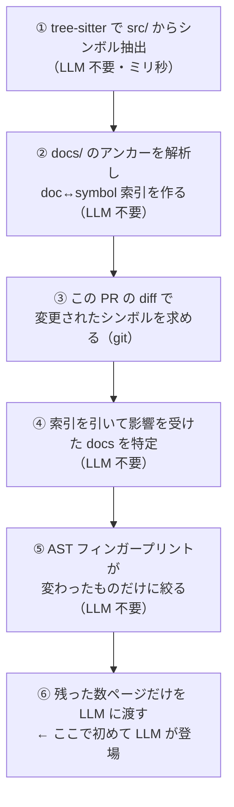

# ハーネスエンジニアリング実践ガイド — 不変条件の機械的強制と検証ループ

作成日: 2026-09-07

> 前提: `notes.md` 2026/9/7（Codex の Skill ベストプラクティス調査・ハーネス調査）で挙げた「課題」と「疑問」への回答
> 対象: AI エージェントに開発させる環境（外部ハーネス）を、これから自分で組む人
> ゴール: 「エージェントが同じミスを繰り返さない環境」を、何から作るか判断できるようになる

---

## 目次

1. [この文書の位置づけ](#1-この文書の位置づけ)
2. [全体像 — 外部ハーネスの3本柱](#2-全体像--外部ハーネスの3本柱)
3. [依存方向の機械的検証](#3-依存方向の機械的検証)
4. [カスタムリンター](#4-カスタムリンター)
5. [構造テスト](#5-構造テスト)
6. [エラーメッセージに修復手順を書く](#6-エラーメッセージに修復手順を書く)
7. [ドキュメントの陳腐化を防ぐ](#7-ドキュメントの陳腐化を防ぐ)
8. [エージェントに何を見せるか](#8-エージェントに何を見せるか)
9. [検証ループ](#9-検証ループ)
10. [着手順と優先順位](#10-着手順と優先順位)
11. [議論の中で修正された認識](#11-議論の中で修正された認識)
12. [未解決の論点](#12-未解決の論点)
13. [参考資料](#13-参考資料)

---

## 1. この文書の位置づけ

### 1.1 前提となる定義

`notes.md` 2026/9/7 で整理した定義を再掲する。

| 用語 | 定義 |
|---|---|
| **ハーネス** | モデル自体ではないコード・設定・実行ロジックのすべて |
| **内部ハーネス** | エージェントの作り手が意識するもの（ReAct ループ、コンパクション、サンドボックス実装） |
| **外部ハーネス** | エージェントにフィードフォワードとフィードバックを与える環境（AGENTS.md、`docs/`、CI、リンター、検証環境） |
| **ハーネスエンジニアリング** | AI エージェントが同じミスをしないように解決策を設計すること |

> **エージェントを使う側の人間が意識すべきなのは外部ハーネス。** 本書はその外部ハーネスの作り方に限定する。

### 1.2 議論の起点となった疑問

本書は、以下の疑問に順に答える形で構成している。

**第1ラウンド**

| # | 疑問 | 回答箇所 |
|---|---|---|
| Q1 | 依存方向の確認を機械的にできるツールはあるか？ | [§3](#3-依存方向の機械的検証) |
| Q2 | カスタムリンターとは何か？ | [§4](#4-カスタムリンター) |
| Q3 | 構造テストとは何か？ | [§5](#5-構造テスト) |
| Q4 | エラーメッセージとそれに対する修復とは？ | [§6](#6-エラーメッセージに修復手順を書く) |
| Q5 | ドキュメントの陳腐化を防止する専用リンターや CI とは？ | [§7](#7-ドキュメントの陳腐化を防ぐ) |
| Q6 | 見なくてよいフォルダの指示は AGENTS.md か Skill か？ | [§8](#8-エージェントに何を見せるか) |
| Q7 | 検証ループを作る具体的な方法は？ | [§9](#9-検証ループ)（詳細は別途議論） |

**第2ラウンド（第1ラウンドの回答に対する追加の疑問）**

| # | 疑問 | 回答箇所 |
|---|---|---|
| Q3-2 | 構造テストは、Q1 の依存方向の検証と同じものと思ってよいか？ | [§5.2](#52-q1-の依存リンターとの関係) |
| Q4-2 | エラーメッセージとは何のことか。人間が失敗を記録して作るのか。どこに表示されているのか？ | [§6.1](#61-それはどこに表示されているものか) |
| Q5-2 | 層2はソースとドキュメントが相互依存するのでは。AI に任せるとトークンを大きく消費するのでは。フロントエンドの画面デザインとコードの連携は難しいのでは。粒度によってはコードから逆探索できないのでは？ | [§7.3](#73-依存の向きは単方向にする)〜[§7.6](#76-腐り方で4分類する) |
| Q6-2 | `.gitignore` に入れたディレクトリをエージェントは見に行かないという認識でよいか。git で追跡したいがエージェントに見せたくないものはどう設定するか？ | [§8.1](#81-gitignore-は秘匿の手段ではない)〜[§8.2](#82-git-で追跡したいが見せたくない場合) |

### 1.3 関連ドキュメント

| ドキュメント | 関係 |
|---|---|
| [ai-development-documentation-guide.md](./ai-development-documentation-guide.md) | 第7章に Bazel / Nx による依存グラフ可視化の具体例。§3 はその続き |
| [tdd-primer.md](./tdd-primer.md) | 検証ループの内側にあるテスト戦略 |
| [../ai-platform/ai-agent-tool-governance-testing.md](../ai-platform/ai-agent-tool-governance-testing.md) | 「エージェントの判断と強制機構を分離する」という原則。本書全体の背骨 |

---

## 2. 全体像 — 外部ハーネスの3本柱

```
                    ┌─────────────────────────────┐
                    │      AI エージェント          │
                    └──────────┬──────────────────┘
                               │ コードを書く
                               ▼
   ┌───────────────────────────────────────────────────────┐
   │  ① 不変条件の機械的強制                                  │
   │     依存リンター / カスタムリンター / 構造テスト           │  §3〜§5
   │     ＋ 修復手順つきエラーメッセージ                        │  §6
   └──────────┬────────────────────────────────────────────┘
              │ 違反すれば必ず落ちる。落ちれば必ず読まれる
              ▼
   ┌───────────────────────────────────────────────────────┐
   │  ② 知識の可視性設計                                      │
   │     見せる（docs/）/ 見なくてよい / 見せてはいけない        │  §7〜§8
   └──────────┬────────────────────────────────────────────┘
              │
              ▼
   ┌───────────────────────────────────────────────────────┐
   │  ③ 検証ループ                                            │
   │     make verify / worktree ごとの起動 / ブラウザ / 可観測性 │  §9
   └──────────┬────────────────────────────────────────────┘
              │ 結果がエージェントのコンテキストに戻る
              └──────────────► エージェントが自己修正
```

### 2.1 本書を貫く4つの原則

| 原則 | 意味 | 出てくる場所 |
|---|---|---|
| **指示は破れる、強制は破れない** | AGENTS.md に書くより、lint・権限・サンドボックスで強制できないかを先に考える | §4, §8 |
| **機械で絞れるところまで機械で絞り、LLM は最後の意味判断だけに使う** | トークン消費は「探索」で爆発する。探索は決定論的処理に任せる | §7.4 |
| **生成できるものは書かない** | 書かなければ腐らない。最も安い陳腐化対策 | §7.6 |
| **エージェントが詰まったら環境を疑う** | もう一度やらせるのではなく、同じ失敗が起きない仕組みを作る | §9 |

---

## 3. 依存方向の機械的検証

> **Q1: 依存方向の確認を機械的にできるツールはあるか？**
> → **ある。しかも3種類あり、役割が違う。**

### 3.1 3つの型

| 型 | 記述場所 | 強制力 | 導入コスト |
|---|---|---|---|
| **① 設定ファイル型リンター** | 専用の設定ファイル | 中（CI が落ちる） | 低 |
| **② 構造テスト型** | テストコード | 中（テストが落ちる） | 中 |
| **③ ビルドシステム型** | ビルド定義 | **高（ビルドが通らない）** | 高 |

### 3.2 ① 設定ファイル型リンター（言語別）

| 言語 | ツール | 特徴 |
|---|---|---|
| Python | **Import Linter** | `layers` / `forbidden` / `independence` / `allowed` の4種の契約 |
| Python | **Tach** | `tach mod` で対話的に境界定義 → `tach check`。Rust 実装で高速、段階導入可 |
| JS/TS | **dependency-cruiser** | ルール検査 **＋依存グラフの可視化**（他ツールにない強み） |
| JS/TS | **`@nx/enforce-module-boundaries`** | プロジェクト tag 同士の依存可否。非 JS は Nx Conformance |
| Go | **go-arch-lint** / **arch-go** | `.go-arch-lint.yml` に宣言。hexagonal / onion / DDD 向け |
| PHP | **Deptrac** | レイヤー定義＋依存ルール |

設計で決めたレイヤー順序を、そのまま転記するだけで機械チェックになる。

```ini
# setup.cfg（Import Linter）
[importlinter:contract:layers]
name = レイヤー順序
type = layers
layers =
    myapp.ui
    myapp.runtime
    myapp.service
    myapp.repository
    myapp.config
    myapp.types
```

### 3.3 ③ ビルドシステム型

Bazel の `visibility` や Nx のプロジェクトグラフは、違反するとそもそもビルドが通らないため最も強い。具体例（`bazel query` による依存経路の表示、逆依存、SVG 出力、`nx graph`）は [ai-development-documentation-guide.md](./ai-development-documentation-guide.md) の第7章に既出。

### 3.4 判断

> **個人開発なら ① を1本だけ CI に入れる。Bazel は重すぎる。**

---

## 4. カスタムリンター

> **Q2: カスタムリンターとは何か？**
> → **既製ルールにない、自分のリポジトリ固有の規約を AST レベルで機械判定するルール。**

### 4.1 なぜ必要か — Skill との棲み分け

`notes.md` で到達した結論の再掲。

```
「N+1 クエリを見逃すな」「顧客データをログに出すな」はどこに書くか？

  ✕ Skill        … 限定的な「手順」の置き場。常時守るべき判断基準ではない
  △ AGENTS.md    … 機械判定できない場合の受け皿
  ⭕ カスタムリンター … 機械判定できるなら、これが正解
```

> **Skill にする前に、lint で機械化できないかを先に考える。**

### 4.2 作り方は3通り

| 手段 | 何か | 向いている場面 |
|---|---|---|
| **ESLint カスタムルール** | `meta` + `create(context)` の AST ビジター | JS/TS。`fixable` で autofix、`RuleTester` でルール自体をテスト可 |
| **Semgrep** | YAML に `id` / `pattern` / `message` / `severity` / `languages` | **多言語・複数リポジトリに同じポリシーを配る**。AST ベース autofix |
| **ast-grep** | パターンマッチの軽量版 | 単発の構造置換 |

> 使い分けの目安：**ESLint は AST ローカルな高速ガードレール、Semgrep は同じポリシーを言語・リポジトリ横断に広げる用。**

### 4.3 作るときの鉄則

- **狭く始めて広げる。** 実際に起きたバグの形にぴったり一致するルールから書く
- **2回しか発火しないが精度100%のルールのほうが、200回発火して精度50%のルールより価値が高い**
- 誤検知が多いと、エージェントが「無視してよい警告」を学習してリンターごと死ぬ
- 全コードベースに流して目視してから、パターンを広げる

### 4.4 開発サイクル

```
① 観測        エージェントが同じミスを2回した（← ここだけ人間）
     ↓
② ルール化    そのミスを検出するルールを書く
     ↓
③ メッセージ  message に「なぜ悪いか・どう直すか」を書く（→ §6）
     ↓
④ 一括修正    既存の違反を autofix でまとめて直す
     ↓
⑤ 再発防止    CI に組み込む（以降は機械が自動でやる）
```

---

## 5. 構造テスト

> **Q3: 構造テストとは何か？**
> → **コードの「振る舞い」ではなく「構造」が設計どおりかを検証するテスト。**

```
ユニットテスト = コードが正しく動くことの検証
構造テスト     = コードの構造が設計に従っていることの検証
```

アーキテクチャの**フィットネス関数**の一実装。通常のテストフレームワーク（pytest / jest / JUnit）で動く。

### 5.1 言語別ツール

| 言語 | ツール |
|---|---|
| Java | **ArchUnit**（元祖） |
| TypeScript | **ts-arch** / **ArchUnitTS** |
| Python | **PyTestArch** / **pytest-archon** / **ArchUnitPython** |
| .NET | **NetArchTest** |
| Go | **arch-go** |

### 5.2 Q1 の依存リンターとの関係

> **Q3-2: 構造テストは、Q1 の依存方向を機械的に検証するものと同じと思ってよいか？**
> → **重なるが同じではない。集合としては「依存方向の検証 ⊂ 構造テスト」。**

```
構造テスト（コードの構造が設計どおりか）
├── 依存方向・レイヤー順序      ← Q1 のツールと重複する領域
├── 循環依存の不在              ← 重複する
├── 命名規約（*Repository は repository/ にしか置かない）
├── 配置規約（テストは実装の隣、public API に docstring 必須）
└── 禁止 API（datetime.now() の直接呼び出し禁止 など）
```

| | 依存リンター（Import Linter / Tach） | 構造テスト（ArchUnit 系） |
|---|---|---|
| 書き方 | 設定ファイルに宣言 | テストコードに条件式で書く |
| 守備範囲 | 依存関係のみ | 依存＋命名・配置・禁止 API など任意 |
| 学習コスト | 低い（5分） | やや高い（API を覚える） |
| 表現力 | 低い（型が決まっている） | 高い（プログラムなので何でも書ける） |

### 5.3 判断

> **両方入れる必要はない。二重管理になる。**

| 状況 | 選択 |
|---|---|
| 依存方向**だけ**守りたい | Q1 のツールのみ（宣言的で読みやすく CI も速い） |
| 命名・配置・禁止 API も守りたい | 構造テストに一本化 |
| 分担する | 可。ただしレイヤー定義が2か所に散る点に注意 |

**個人開発なら Q1 のツール1本から始め、「依存方向では表現できない規約」が実際に出てきた時点で構造テストを足す。**

---

## 6. エラーメッセージに修復手順を書く

> **Q4-2: これはつまり、AI エージェントが失敗した部分とその原因を人間が記録して作成するものか？ また、何のエラーメッセージなのか、どこに表示されているものなのかが分からない。**

### 6.1 それはどこに表示されているものか

**エージェントが実行したコマンドの標準出力である。** 特別な仕組みではなく、人間がターミナルで lint を流したときに見えるのとまったく同じ文字列。

```
エージェントがコードを書く
        ↓
エージェントが `npm run lint` / `pytest` / `make verify` を実行する
        ↓
その出力（＝エラーメッセージ）が、ツール実行結果として
エージェントのコンテキストに自動で入る    ← ここ
        ↓
エージェントはそれを読んで自分で直す
```

投資する価値がある理由はひとつだけ。

> **AGENTS.md は「読まれるかもしれない」。エラーメッセージは「必ず読まれる」。**
> 読まれることが保証された唯一のドキュメントである。

### 6.2 人間が記録して作るのか

**成果物としては違う。きっかけとしては半分正しい。**

| | |
|---|---|
| ❌ | エージェントの失敗ログを人間が集めて、どこかに書き溜める作業 |
| ⭕ | **ルールを作るときに、そのルールの `message` に直し方まで書いておく**作業 |

人間が観測するのは §4.4 のサイクルの①だけで、②以降は機械に落ちる。**Q4 は独立したタスクではなく、Q2・Q4 でルールを書くときに `message` を1行で済ませず3行書く、という話。**

### 6.3 良いエラーメッセージの4要素

```
1. 何が違反したか       : Avoid passing async functions to array methods.
2. なぜ悪いか           : This returns an array of Promises, not resolved values.
3. どう直すか（具体案） : Use Promise.all() or a for...of loop instead.
4. 根拠へのリンク       : See docs/dev-process/async.md
```

### 6.4 書く場所（実例）

**ESLint カスタムルール**

```js
// eslint-rules/no-async-array-method.js
module.exports = {
  meta: {
    type: 'problem',
    docs: { description: '配列メソッドに async 関数を渡さない' },
    messages: {
      // ↓ この文字列がそのままエージェントのコンテキストに入る
      noAsyncArrayMethod:
        'Avoid passing async functions to array methods. ' +
        'This returns an array of Promises, not resolved values. ' +
        'Use Promise.all() or a for...of loop instead. ' +
        'See docs/dev-process/async.md',
    },
  },
  create(context) { /* AST を見て context.report({ messageId: ... }) */ },
}
```

**Semgrep**

```yaml
rules:
  - id: no-customer-data-in-logs
    pattern: logger.$METHOD(..., $USER.email, ...)
    message: >
      顧客データ（email）をログに出力しています。
      監査ログには user_id のみを出してください。
      マスクが必要な場合は utils/mask.py の mask_pii() を使います。
      根拠: docs/ai-platform/logging-policy.md
    severity: ERROR
    languages: [python]
```

**構造テストのアサーション**

```python
assert not violations, (
    f"service 層が ui 層を参照しています: {violations}\n"
    f"修正方法: 必要なデータは service 層の DTO として定義し、ui 側で変換してください。\n"
    f"レイヤー定義: docs/dev-process/architecture.md#layers"
)
```

**シェルスクリプト**（ルールを作る余裕がない場合でもこれだけで効く）

```bash
if ! rg -q 'ttl_days' "$doc"; then
  echo "ERROR: $doc に ttl_days がありません。"
  echo "  対処: frontmatter に 'ttl_days: 180' を追加してください。"
  echo "  意味: docs/dev-process/harness-engineering-guide.md を参照。"
  exit 1
fi
```

### 6.5 ビフォー／アフター

| | メッセージ | エージェントの行動 |
|---|---|---|
| ❌ | `Error: layer violation in service/user.py:42` | 何が悪いか推測 → 適当に import を消す → 別の場所が壊れる |
| ⭕ | `service 層が ui 層を参照しています。DTO を定義して ui 側で変換してください。定義: docs/.../architecture.md#layers` | 意図どおりの修正を1回で行う |

研究上も、修復エージェントへのフィードバックは「6行目のバグを直して」より「**6行目の引数が間違っているので直して**」のほうが正確なパッチになるとされる。

### 6.6 修復まで機械化する層

| 層 | 手段 |
|---|---|
| 完全自動 | ESLint `--fix` / Semgrep autofix（AST ベースで壊れない修正を生成） |
| 半自動 | メッセージに修復手順を書き、エージェントに直させる |
| 大規模 | BitsAI-Fix のように LLM で search-replace パッチを生成し、**lint 再スキャンで検証** |

### 6.7 「モデルの進化で不要になるのでは」への回答

`notes.md` の反省に対して。

> **半分正しく、半分違う。**
>
> - **「どう直すか」の部分**は、モデルが賢くなれば要らなくなる可能性が高い
> - **「そもそもこれが違反である」という判定**は、モデルがいくら賢くなっても消えない
>   （自分のリポジトリの規約はモデルの事前知識に存在しないため）
>
> → 投資するなら、**修復手順の文面より検出ルール（§3〜§5）のほうが寿命が長い。**

---

## 7. ドキュメントの陳腐化を防ぐ

> **Q5: ドキュメントの陳腐化を防止できる専用リンターや CI とはどのようなものか？**

### 7.1 3層構造

| 層 | 何をするか | 難易度 |
|---|---|---|
| **層1 形式チェック** | リンク切れ、用語統一、Markdown 構造、API 仕様 | 低 |
| **層2 コードとの結びつき検査** | ドキュメントの記述をソースのシンボルにアンカーして差分検出 | 中〜高 |
| **層3 LLM による意味チェック** | 層2 の灰色ゾーンだけを LLM が判定 | 中 |

**層1**

| 対象 | ツール |
|---|---|
| リンク切れ | lychee、markdown-link-check |
| 用語・文体 | **Vale**（独自スタイル辞書を持てる） |
| Markdown 構造 | markdownlint |
| API 仕様 | **Spectral**（OpenAPI/AsyncAPI をルールセットで検証）、Dredd |
| コード例 | Rust doctest / Python doctest（**サンプルをテストとして実行する**のが最も確実） |

**層2**（Fiberplane の `drift` が分かりやすい実装）

```markdown
<!-- docs/auth.md -->
## 認証設定
@./src/auth/provider.ts#AuthConfig@a1b2c3d

`AuthConfig` は起動時に一度だけ読み込まれ、...
```

- アンカーは `ファイルパス#シンボル名@ベースラインSHA` の3点セット
- tree-sitter で **AST フィンガープリント**（ノード種別＋トークン、空白・位置は無視）を取る → **整形しただけでは誤検知しない**
- ベースライン時点の AST と現在を比較し、違えば陳腐化と判定
- `drift check` は陳腐化があれば exit 1 → CI が落ちる
- 確認して直したら `drift link` でスタンプし直す

**freshness スコア**（Dosu 方式）は、これを 0〜100 点に量る。

```
freshness = max(0, 100 - (age_penalty + drift_penalty + ttl_penalty))

age_penalty   : ドキュメント最終更新と参照先コード最終更新の日数差
ttl_penalty   : frontmatter の ttl_days を過ぎた日数 × 2
drift_penalty : 文中で言及した関数・クラス名が消えていたら1個あたり10点（最大40）
```

運用の閾値例：PR で平均4点以上低下したらレビュー必須／中央値75以上を維持／重要ページは60点を下限。

**層3**

```yaml
- name: Claude semantic check
  uses: anthropics/claude-code-action@v1
  with:
    claude_args: --max-turns 8
    prompt: |
      Decide whether documented behavior matches code.
      Respond: STILL_ACCURATE, DRIFTED, or NEEDS_HUMAN_REVIEW
```

> **PR を落とすのは決定論的スコアだけ。LLM の判定は助言に留める。**
> これは [ai-agent-tool-governance-testing.md](../ai-platform/ai-agent-tool-governance-testing.md) の「LLM as a judge に強制力を持たせない」と同じ形。

### 7.2 PR ゲート（最も安い予防）

CODEOWNERS と branch protection で、**特定のソースを変更したら対応する docs の更新を必須にする**。ツール導入ゼロで効く。

### 7.3 依存の向きは単方向にする

> **Q5-2: つまり、ソースコードとドキュメントが相互に依存するということか？**
> → **相互依存にしてはいけない。依存は片方向（docs → code）にする。**

```
❌ 相互依存                          ⭕ 単方向
docs  ⇄  code                       docs  →  code
（コードを直すと docs 参照も直す）    （docs だけがコードを知っている。
                                       コードは docs を知らない）
```

理由は §3 のレイヤー依存とまったく同じ。コード側にアンカーを書くと、**コードが「自分がどのドキュメントに説明されているか」を知る**ことになり、ドキュメントの移動・分割のたびにコードを触る羽目になる。変更頻度が高いのはコードのほうなので、依存の向きが逆。

例外は ADR 番号のみ。`// ADR-0007 によりここは同期実装のまま` は、ADR が不変（§7.6）なので壊れない。

### 7.4 トークン消費をどう抑えるか

> **Q5-2: AI エージェントに任せると、対応するドキュメントの該当箇所を探すことになりトークンを大きく消費するのでは？**
> → **完全に正しい懸念。設計で回避する。要点は「探させない。索引を先に作る」。**



| 方式 | 1 PR あたりの消費 |
|---|---|
| ❌ エージェントに探索させる | 数十万〜数百万トークン（**リポジトリ規模に比例**） |
| ⭕ 索引 → 灰色ゾーンのみ LLM | 数千〜数万トークン（**変更量に比例**） |

> **一般化：機械的に絞れるところまで機械で絞り、LLM は最後の意味判断だけに使う。**
> `notes.md` の「トークン消費を抑えながらエージェントのタスクを実行する仕組み」の具体例にあたる。

アンカーを書くコスト自体はエージェントに任せてよい。**判断（この差分で記述は実質変わるか）は人間かエージェント、記録（SHA の打ち直し）は機械。**

### 7.5 フロントエンドの画面デザインとコードの連携

> **Q5-2: フロントエンドは画面デザインとコードの連携が難しいのでは？**
> → **文章で書こうとするから難しい。フロントエンドは層2の対象にせず、「実行可能な成果物」に置き換える。**

**なぜ文章化が破綻するか**

「ボタンは右上、色は青、押すとモーダルが開く」という記述は、

- コードのシンボルにアンカーできない（見た目は AST に現れない）
- 変更頻度が最も高い
- 文章と実物のどちらが正か、読んだだけでは判定できない

**実務的な解**

| 手段 | 内容 |
|---|---|
| **① Storybook を実行可能なドキュメントにする（本命）** | story がドキュメントであり同時にテスト。実物とずれた瞬間にテストが落ちるので、構造的に陳腐化しない。2026年時点の Storybook はインタラクションテスト・ビジュアル回帰・a11y を CI で回すコンポーネントテスト基盤 |
| **② ビジュアル回帰を CI に入れる** | Chromatic は **story 1つが自動的にビジュアルテスト1件**（Percy / Applitools がページ単位なのに対しコンポーネント単位）。2026年に Applitools と Chromatic が **MCP 連携を出荷**し、エージェントが「検証済みの UI 状態」を参照できるようになった |
| **③ Figma Code Connect + Dev Mode MCP** | Figma のコンポーネントとリポジトリのコンポーネントを結びつけ、機械可読なデザイン文脈（コンポーネント・変数・マッピング）をエージェントに渡す。**デザイントークンはコード側の値と Figma 変数を突き合わせてドリフト検出できる** |
| **④ スクリーンショットは書かず生成する** | 手で貼ったキャプチャは100%腐る。CI が最新 UI から自動生成して差し替える |

> 公開された UI 文脈がないと、エージェントはそれぞれ違うルールで判断してドリフトする。
> **これは §9 の検証ループそのもの。フロントエンドでは、陳腐化対策と検証ループが同じ仕組みで解ける。**

**文章として残すべきものは「なぜそうしたか」だけ。**

```
❌ docs に書く：ボタンは右上に配置し、色は #0066CC
⭕ Storybook   ：Button.stories.tsx（実物。テストで守られる）
⭕ docs に書く：削除操作を右上に置かないのは、2026/3 に誤操作の
               問い合わせが集中したため（ADR-0012）
```

### 7.6 腐り方で4分類する

> **Q5-2: ドキュメントの粒度によっては、コードから逆探索することが難しいのでは？**
> → **その通り。そこは層2の対象外。ドキュメントは「腐り方」で4つに分け、対策を変える。**

| 種別 | 例 | 腐る速度 | 正しい対策 | 層2は使えるか |
|---|---|---|---|---|
| **参照系** | API 仕様、設定一覧、スキーマ、CLI ヘルプ | 最速 | **手で書かない。コードから生成する** | 不要（生成物は腐らない） |
| **手順系** | セットアップ、ランブック | 速い | **実行可能にする**（doctest、CI で実行、`make setup` 化） | 不要（実行して落ちる） |
| **説明系** | 「この関数は何をするか」「この設計はどう動くか」 | 中 | **アンカー方式（層2）** | ⭕ ここが本領 |
| **判断系** | ADR、「なぜこの選択をしたか」 | 遅い／腐らない | **不変 + supersede 運用** | ✕ 使わない |

**参照系：「生成できるものは書かない」**

陳腐化対策として最も強力で、しかも最も安い。層2 を入れるより先にやる。書かなければ腐らない。

**判断系：ADR は腐らない**

ADR は**不変（immutable）**として運用する。決定を見直すときは元の ADR を書き換えず、ステータスを `Superseded by ADR-0021` に変え、新しい ADR を書く。

> **ADR 自体は陳腐化しない。それが不変性の目的である。**
> 陳腐化するのは ADR の内容ではなく、**古い決定の「含意」**のほう
> （2024年には正しかった判断が、2026年には状況が変わって正しくない）。
> → 対策はアンカーではなく、**レビュー時に読み返して supersede する**運用。

**アンカーできないドキュメントへの対策：TTL + オーナー**

```markdown
---
ttl_days: 180          # 半年で要レビュー
owner: hiroaki
last_reviewed: 2026-09-07
kind: decision         # reference / procedure / explanation / decision
---
```

`ttl_penalty = 超過日数 × 2` として、期限切れが自動的にスコアを下げる。
**「コードとの対応は取れないが、放置されていることは検出できる」** ——これがアンカー不能なドキュメントに対する現実的な答え。

### 7.7 このリポジトリへの適用

`docs/` にある7本は、ほぼすべて**判断系＋説明系**（調査と議論のまとめであって API 仕様ではない）。したがって**層2（アンカー）は不要**で、TTL とレビューで管理するのが適切。`durable-execution-tools.md` が冒頭に「調査時点: 2026年8月」と書いているのは、すでに TTL 運用そのものになっている。

**実装順**

1. **「生成できるものは書かない」を徹底**（コスト0、効果最大）
2. **frontmatter に `kind` / `ttl_days` / `owner` を入れる**
3. **lychee でリンク切れ CI**（相対リンクが増えたため）
4. **CI は PR の差分にだけ働かせる**（O(変更) を死守）
5. 説明系ドキュメントができたらアンカーを導入
6. フロントを書くなら Storybook + Chromatic
7. LLM は灰色ゾーン限定・助言のみ・**PR を落とす権限は与えない**

> **§7 の核心：ドキュメントを「腐り方」で分類し、参照系は生成に、手順系は実行に、説明系はアンカーに、判断系は不変運用に振り分ける。全部を同じ仕組みで守ろうとすると破綻する。**

---

## 8. エージェントに何を見せるか

> **Q6: 見なくてもよいフォルダを指示するときは、AGENTS.md か Skill か？**
> → **どちらでもない。第一にハーネスの設定（権限・ignore）。AGENTS.md は補助、Skill は不適切。**

### 8.1 `.gitignore` は秘匿の手段ではない

> **Q6-2: `.gitignore` に入っているディレクトリは、エージェントは見に行かないという認識でよいか？**
> → **「見に行かない」保証はない。ノイズ削減には効くが、秘匿の手段としては不十分。**

| 経路 | `.gitignore` の効果 |
|---|---|
| ripgrep ベースの検索 | 既定で無視されるので**実質見えない** |
| ファイル一覧・探索系ツール | ツールと実装による（Claude Code の Glob が尊重しないという報告あり） |
| パス直指定の読み取り（Read、`cat`） | **無視されない。読める** |
| 任意のサブプロセス（`python -c "open(...)"`） | もちろん読める |

`.claudeignore` も「自動的に文脈へ入るのを防ぐが、ファイルは存在し検索で見つかりうる」という限界が報告されている。Codex CLI に至っては `.codexignore` 自体が未実装（要望 issue #205 → #2847 → #24993 が継続中）。

> **原則：ignore ファイルは「見なくてよいもの」を減らす道具であって、「見せてはいけないもの」を守る道具ではない。**

### 8.2 git で追跡したいが見せたくない場合

強度の順に4つ。

**① 権限ルールで拒否（Claude Code、すぐできる）**

```json
// .claude/settings.json
{
  "permissions": {
    "deny": [
      "Read(./secrets/**)",
      "Read(./config/production.yml)",
      "Read(.env)"
    ]
  }
}
```

公式ドキュメント上、この `Read` deny ルールがカバーする範囲は以下。

| カバーする | カバーしない |
|---|---|
| 組み込みファイルツール（Read / Grep 等） | **ファイルを間接的に読む任意のサブプロセス**（自分でファイルを開く Python / Node スクリプト） |
| Claude Code が認識する Bash のファイルコマンド（`cat`, `head`, `tail`, `sed`） | |
| Bash のリダイレクト先（`> file`, `< file`） | |
| 同じパスへの Edit / Write（新規作成含む） | |

パターンは gitignore 構文。deny ルールとして書いた `Read(secrets/**)` は**任意の深さの `secrets` にマッチ**する。deny はフォルダの信頼を待たず即時適用され、PreToolUse フックが `allow` を返しても deny が優先される。

**② サンドボックスを有効にする（OS レベル強制）**

①の抜け穴を塞ぐにはこれが必要。**サンドボックスの境界には Read/Edit の deny ルールがマージされる**ので、①と②はセットで使う。Codex CLI も同様に、サンドボックスと権限プロファイルがディレクトリ境界の強制手段。

**③ 暗号化してコミットする（最も堅い・ツール非依存）**

SOPS や git-crypt で暗号化すれば、**リポジトリに存在するのは暗号文だけ**になる。エージェントが読んでも意味を成さず、モデルに送られても情報が漏れない。ツールの実装や設定ミスに依存しないため、**「git で追跡したいが見せたくない」への本命の答えはこれ。**

```
config/production.yml       ← 削除
config/production.enc.yml   ← SOPS で暗号化してコミット。復号は CI と本人だけ
```

**④ そもそもワークツリーに置かない**

別リポジトリ、シークレットマネージャ（1Password / Vault / AWS Secrets Manager）、環境変数注入。エージェント以前に、本来の姿。

### 8.3 3分類と手段の対応

`notes.md` の3分類に、手段を割り当てるとこうなる。

| 分類 | 例 | 手段 |
|---|---|---|
| **見せる** | 判断の根拠になる知識（なぜこのライブラリか、なぜ後方互換を壊せないか） | `docs/` に置く |
| **見なくてよい** | ビルド生成物、巨大フィクスチャ、`node_modules` | `.gitignore`（ノイズ削減目的なので十分） |
| **見せたくない** | 追跡はしたい設定ファイル | **③ 暗号化** ＋ ① deny ルール |
| **絶対に漏らせない** | 本番認証情報、顧客データ | **④ 置かない** ＋ ② サンドボックス |

### 8.4 AGENTS.md と Skill の役割

| 置き場所 | 書いてよいこと | 理由 |
|---|---|---|
| **AGENTS.md** | 「`generated/` は自動生成なので読まない・編集しない」程度の**探索指針を1〜2行** | 常時有効な「知識」なので置き場所として正しい。ただし**百科事典ではなく目次**。長い除外リストは設定ファイルの仕事 |
| **Skill** | **恒常的な除外は不適切**。「この作業の間だけ `docs/legacy/` は見るな」のような作業限定の探索範囲のみ | Skill は「限定的に必要な手順」。その Skill が起動していないときに無効になる |

> **優先順位：強制できるものは設定で強制 → 残りを AGENTS.md に1行。**
> §4.1 の「Skill にする前に lint で機械化できないか考える」と同じ判断軸。

---

## 9. 検証ループ

> **Q7: 検証ループを作る具体的な方法は？**（詳細は別途議論予定。ここでは概要のみ）

### 9.1 OpenAI の実装（harness engineering）

1. **git ワークツリーごとにアプリを起動可能にする** — 変更ごとに独立インスタンスをエージェントが立てて操作
2. **Chrome DevTools Protocol をエージェントのランタイムに組み込む** — DOM スナップショット・スクリーンショット・ナビゲーションを Skill 化し、バグ再現と修正検証を直接やらせる
3. **ワークツリーごとにエフェメラルな可観測性スタック** — ログ・メトリクス・トレースを LogQL / PromQL でクエリさせ、タスク終了時に破棄
4. **不変条件をレイヤー依存で固定**（Types → Config → Repo → Service → Runtime → UI）し、**カスタムリンターと構造テストで強制**（＝§3〜§5）
5. **バックグラウンドの Codex タスクが常時パターン逸脱を走査**し、リファクタ PR を出して低リスクなものは自動マージ

### 9.2 個人で段階的に組む

| Lv | やること | 得られるもの |
|---|---|---|
| **1** | `make verify` 一発で lint + 型 + テスト + 構造テストが走るようにし、AGENTS.md に「変更後は必ず `make verify`」と書く | **これだけで8割**。エージェントが自己修正できる最小ループ |
| **2** | ワークツリーごとにポートを変えて起動できるようにする | 並行作業しても壊れない。エージェントが自分で起動・確認できる |
| **3** | ブラウザ操作を渡す（**chrome-devtools-mcp** はコンソール・ネットワーク取得＝デバッグ向き、**Playwright MCP** は再現性＝検証向き） | 「動いているか」をエージェント自身が確認できる |
| **4** | ログを構造化して stdout に出し、ローカルの Loki / Prometheus に流す | エージェントが「なぜ失敗したか」を自分で調べられる |

### 9.3 最も重要な原則

> **エージェントが詰まったら、プロンプトではなく環境を疑う。**
> 失敗したとき「もう一度やらせる」のではなく、「同じ失敗が二度と起きない仕組みを作る」。
> どのような機能が不足しているのか、それをエージェントにとって理解可能かつ実行可能にするにはどうすればよいのかを問う。

---

## 10. 着手順と優先順位

| 順 | 項目 | コスト | 効果 | 理由 |
|---|---|---|---|---|
| **1** | **依存リンター**（§3） | 低 | 高 | 設計は既にできている。転記するだけ |
| **2** | **`make verify`**（§9 Lv1） | 低 | 高 | 他のすべての受け皿になる |
| **3** | **エラーメッセージ整備**（§6） | 低 | 高 | 既存 lint の message に修復手順を足すだけ |
| **4** | **除外設定**（§8） | 低 | 中 | `permissions.deny` は数行。暗号化はその次 |
| **5** | **「生成できるものは書かない」**（§7.6） | 低 | 高 | 陳腐化対策で最も安く強い |
| 6 | 構造テスト（§5） | 中 | 中 | 依存以外の規約が必要になってから |
| 7 | カスタムリンター（§4） | 中 | 中 | **実際にドリフトを観測してから**作る |
| 8 | ドキュメント陳腐化の層2（§7.1） | 高 | 高 | コードを持つリポジトリになってから |
| 9 | 検証ループ Lv2〜4（§9.2） | 高 | 高 | アプリを作り始めてから |

---

## 11. 議論の中で修正された認識

| 当初の認識 | 修正後 | 節 |
|---|---|---|
| 構造テストと依存方向の検証は同じもの | **包含関係**（依存方向の検証 ⊂ 構造テスト）。両方入れると二重管理 | §5.2 |
| エラーメッセージは、エージェントの失敗を人間が記録して作るもの | **ルールの `message` に修復手順を書くこと**。人間が関わるのは「観測」だけ | §6.2 |
| エラーメッセージはどこかに表示される特別なもの | **エージェントが実行したコマンドの標準出力**。人間が見るのと同じもの | §6.1 |
| `.gitignore` に入れればエージェントは見ない | **保証はない**。パス直指定や任意プロセスからは読める | §8.1 |
| ドキュメントとコードは相互依存する | **単方向（docs → code）にする。** コードは docs を知らない | §7.3 |
| 陳腐化対策は全ドキュメントに同じ仕組みを当てる | **腐り方で4分類**し、生成／実行／アンカー／不変運用に振り分ける | §7.6 |
| 陳腐化検査を AI に任せるとトークンを食う | **正しい。だから探索を機械に任せ、LLM は灰色ゾーンだけ** | §7.4 |
| フロントエンドは画面デザインとコードの連携が難しい | **文章化しない。** Storybook + ビジュアル回帰という実行可能な成果物に置き換える | §7.5 |
| ハーネスはモデルの進化で不要になるのでは | **検出ルールは残り、修復手順の文面は要らなくなる**（寿命が違う） | §6.7 |

---

## 12. 未解決の論点

- **Q7 の詳細** — 検証ループの具体的な構築手順（別途議論予定）
- **ドキュメント整備エージェントの設計** — 定期実行して陳腐化を修正 PR にするエージェントを、どの粒度・どの頻度で動かすか
- **トークン最適化の一般則** — §7.4 で得た「機械で絞り、LLM は最後だけ」を、陳腐化検査以外にどう横展開するか
- **`docs/` への TTL 導入** — このリポジトリの7本に `kind` / `ttl_days` / `owner` を入れるかどうか

---

## 13. 参考資料

**ハーネスエンジニアリング**
- [Harness engineering: leveraging Codex in an agent-first world | OpenAI](https://openai.com/index/harness-engineering/)
- [Using Linters to Direct Agents | Factory.ai](https://factory.ai/news/using-linters-to-direct-agents)

**依存方向・構造テスト**
- [Import Linter](https://import-linter.readthedocs.io/en/stable/) / [Tach](https://github.com/tach-org/tach) / [dependency-cruiser 解説](https://xebia.com/blog/taking-frontend-architecture-serious-with-dependency-cruiser/) / [Nx Enforce Module Boundaries](https://nx.dev/docs/features/enforce-module-boundaries) / [go-arch-lint](https://github.com/fe3dback/go-arch-lint)
- [ArchUnit](https://github.com/TNG/ArchUnit) / [ts-arch](https://github.com/ts-arch/ts-arch) / [ArchUnitTS](https://github.com/LukasNiessen/ArchUnitTS) / [arch-go](https://github.com/arch-go/arch-go)
- [Fitness Functions ガイド](https://lukasniessen.com/blog/155-fitness-functions-guide/)

**カスタムリンター・エラーメッセージ**
- [ESLint Custom Rule Tutorial](https://eslint.org/docs/latest/extend/custom-rule-tutorial) / [Semgrep autofix](https://semgrep.dev/blog/2022/autofixing-code-with-semgrep/)
- [eslint-plugin-llm-core](https://dev.to/pertrai1/i-analyzed-500-ai-coding-mistakes-and-built-an-eslint-plugin-to-catch-them-jme) / [BitsAI-Fix (arXiv)](https://arxiv.org/abs/2508.03487)

**ドキュメント陳腐化**
- [drift: a linter for documentation rot | Fiberplane](https://fiberplane.com/blog/drift-documentation-linter/)
- [Score Documentation Freshness in CI | Dosu](https://dosu.dev/blog/score-documentation-freshness-in-ci)
- [Docs Linting Guide | Fern](https://buildwithfern.com/post/docs-linting-guide) / [Documentation Drift | Docsie](https://www.docsie.io/blog/glossary/documentation-drift/)
- [Architecture Decision Records: The 2026 Guide | Catio](https://www.catio.tech/blog/architecture-decision-record) / [Maintain an ADR | Microsoft](https://learn.microsoft.com/en-us/azure/well-architected/architect-role/architecture-decision-record)

**フロントエンド**
- [Storybook for AI](https://storybook.js.org/ai) / [Chromatic Visual Testing Guide 2026](https://qaskills.sh/blog/chromatic-storybook-visual-testing-guide) / [Visual Regression Testing in the Age of AI UIs | Augment Code](https://www.augmentcode.com/guides/visual-regression-testing-ai-generated-uis)
- [Code Connect | Figma](https://help.figma.com/hc/en-us/articles/23920389749655-Code-Connect) / [Dev Mode MCP server | Figma](https://www.figma.com/blog/introducing-figma-mcp-server/)

**可視性・権限**
- [Configure permissions | Claude Code](https://code.claude.com/docs/en/permissions) / [Claude Code settings](https://code.claude.com/docs/en/settings)
- codex issues [#205](https://github.com/openai/codex/issues/205) / [#2847](https://github.com/openai/codex/issues/2847) / [#24993](https://github.com/openai/codex/issues/24993)
- [Chrome DevTools MCP](https://mcpservers.org/servers/chrome-devtools-mcp-server) / [Playwright MCP との比較](https://stevekinney.com/writing/driving-vs-debugging-the-browser)
