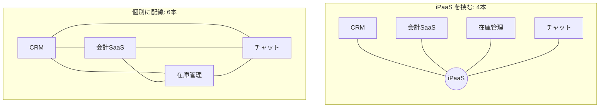
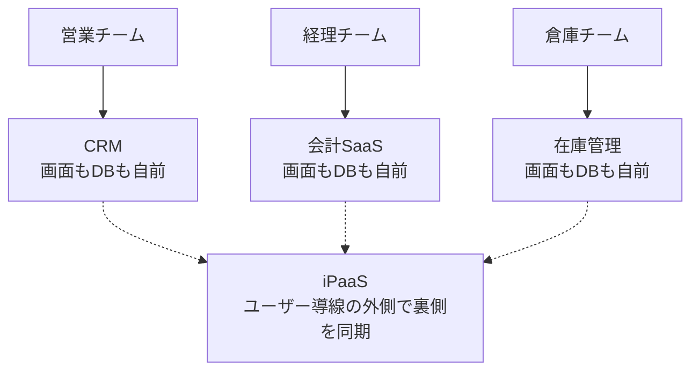
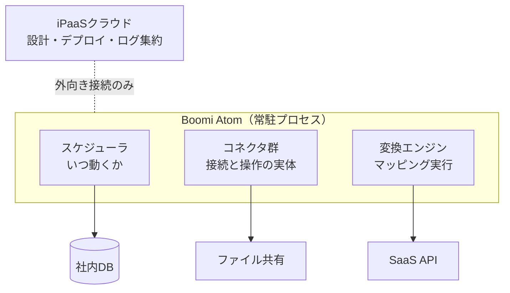

# iPaaS 入門 — バックエンドエンジニアのための整理

> 対象: 「iPaaS っていう言葉は見たけど、実体がよく分からない」人
> ゴール: 本や資料で iPaaS が出てきたときに、それがどの層の話をしているか判断できるようになる

---

## 1. 一言でいうと

**iPaaS = Integration Platform as a Service（アイパース）**

> 異なるアプリケーションやシステム間のデータ統合や相互連携を行うための、クラウドベースのプラットフォーム

もっと噛み砕くと、**SaaS 同士をつなぐ配線工事を、クラウド上で代行してくれるサービス**です。

### この文書の結論を先に

長い文書なので、先に着地点を置いておきます。

> **iPaaS の役割は、複数の既存サービスを横断するデータの整合性を保ち、その状態を維持し続けるための安定した基盤を作ることにある。**

人間も AI エージェントも、**データがなければ動けません**。そしてデータが間違っていれば、どちらも同じように判断を誤ります。iPaaS はその土台を、決定論的に、追跡可能な形で支える道具です。

逆に、iPaaS が担わないものもはっきりしています。**AI エージェントの権限管理も、エージェントの実行制御も、iPaaS の仕事ではありません**（→ §15、そして次の文書で扱う durable execution）。

---

## 2. なぜ必要なのか

社内に SaaS が増えると、それらを個別に連携させるコストが組み合わせ的に増えていきます。



しかも各連携ごとに以下が必要になります。

- 認証情報の管理（OAuth トークンの保管と自動更新）
- API のレート制限への対応
- エラー時のリトライ
- 相手の API 仕様変更への追従

これを自前スクリプトでやると、**誰も触れないバッチ処理が社内に散乱します。**

---

## 3. iPaaS の位置づけ — ここを間違えやすい

### 3.1 ユーザーの導線上にいない

各 SaaS の画面はそのまま残ります。iPaaS は **UI を置き換えません**。



### 3.2 BFF / API Gateway とは別物

「複数のバックエンドを1枚のレイヤーでまとめる」というイメージは BFF や API Gateway の絵です。iPaaS はそこではありません。

| | BFF / API Gateway | iPaaS |
|---|---|---|
| 位置 | ユーザーリクエストの経路上 | 経路の外側 |
| 同期性 | 同期（レスポンスを返す） | 非同期・イベント駆動が主 |
| 呼ぶ人 | フロントエンド | 誰も呼ばない（トリガーで自走） |
| 気にする指標 | レイテンシ | 結果整合するまでの遅延、失敗率 |
| 主な向き | 読み取りの集約 | 書き込みの伝播 |

**依存の向きに注意。** バックエンドは誰かに呼ばれてレスポンスを返しますが、iPaaS は誰からも呼ばれません。iPaaS のほうが各 SaaS の API を呼びに行く側です。「バックエンドの下」ではなく「**バックエンド同士の横に立つ第三者**」。

### 3.3 データを持たない

| 持つもの | 持たないもの |
|---|---|
| 連携レシピ（プロセス） | 顧客レコード |
| マッピング定義 | 請求データ |
| 各 SaaS の認証情報 | 在庫数 |
| 実行ログ | |
| システム間の **ID 対応表** | |

データは iPaaS を**通過するだけ**です。**中継所であって倉庫ではありません。**

---

## 4. 「データ連携」の本当の難所

### 4.1 同じ実体が別 ID で重複している

```
CRM                会計SaaS              在庫管理
id: 001            id: C-8823           id: cust_44
山田太郎／部長      山田太郎／課長(古い)   ヤマダタロウ
   |                   |                    |
   +-------------------+--------------------+
                       |
            iPaaS が持つのは対応表だけ
            001 = C-8823 = cust_44
            業務データ本体はどこにも集約されない
```

### 4.2 状態が揃わない4つの構造的理由

| # | 原因 | 具体例 |
|---|---|---|
| 1 | ID 体系が違う | 各 SaaS が勝手に採番。表記ゆれ（(株)／株式会社、全角半角）で突合が失敗する |
| 2 | 更新タイミングがずれる | 非同期なので必ずラグがある。夜間バッチなら翌朝 |
| 3 | 双方向更新が衝突する | どちらが勝つか決めないと無限ループ（A更新→B伝播→B更新検知→A伝播…） |
| 4 | 削除が伝播しない | 削除イベントを飛ばさない SaaS は普通にある |

### 4.3 だから設計で決めるべきは1つ

iPaaS が保証できるのは「**いずれ揃う**」であって「常に揃っている」ではありません。分散システムでいう結果整合性です。

**項目単位で source of truth を決めて、そこから外向きの一方向同期にする。** これが定石です。

| 項目 | 正とするシステム |
|---|---|
| 顧客の会社名・住所 | CRM |
| 請求金額・入金ステータス | 会計SaaS |
| 在庫数 | 在庫管理 |

> 「どっちからでも更新できて常に一致する」を目指すと破綻します。

---

## 5. 「データ連携」は4層ある

プロトコルの話なのか整合性の話なのか、資料によって指しているものが違います。

```
┌─────────────────────────────────────┐
│  業務プロセス・整合性                 │  ← どちらを正とするか、失敗時の扱い
├─────────────────────────────────────┤
│  意味・スキーマ                       │  ← 項目名、日付形式、ID突合
├─────────────────────────────────────┤
│  フォーマット                         │  ← JSON、XML、CSV、固定長
├─────────────────────────────────────┤
│  プロトコル                           │  ← REST、SOAP、SFTP、EDI
└─────────────────────────────────────┘
     下2層 = つなぐ  /  上2層 = 意味を揃える
```

SaaS 時代になって下2層がほぼ HTTPS + JSON + REST に収束したため、**難所が上に移りました。**ただし EDI や銀行のレガシー接続では今も下層が主戦場です。

**読むときの目安**

| 資料の表現 | どの層の話か |
|---|---|
| 「コネクタが1000種類」 | プロトコル層 |
| 「マッピング」「変換」 | スキーマ層 |
| 「同期」「マスタ」「正」 | 整合性層 |

**実務でコストがかかるのは、ほぼ常に上の層です。** つなぐのは1日で終わっても、「受注が二重計上された」の原因調査は1週間かかります。

---

## 6. 3つの登場人物 — プロセス / Atom / コネクタ

Boomi を例にした場合の構成要素です。ここを混同しやすいので明確に分けます。

| 名前 | 何か | Go でいうと |
|---|---|---|
| **プロセス** | 同期のルール本体。クラウドで GUI 設計する | 同期処理の関数の中身 |
| **Atom** | プロセスを実行する常駐ランタイム（Java） | cron + ワーカー + リトライ + ログの土台 |
| **コネクタ** | 相手ごとの喋り方を知っている部品 | `salesforce` / `freee` などのクライアントパッケージ |



### 6.1 コネクタ — ここが一番つまずく

「コネクタ」という言葉は実体に対して控えめすぎます。**つなぐもの、ではありません。相手1社分の接続キット一式**です。Salesforce 用、freee 用、Slack 用、と相手ごとに1個ずつ存在します。

#### 役割は1つだけ

> **相手のシステムから、データを出し入れすること**

やることは2つしかありません。

- **取ってくる**（freee から請求書一覧を読む）
- **送り込む**（freee に請求書を1件書く）

**コネクタはデータの中身を判断しません。加工もしません。** 指定された相手に対して、読むか書くかをするだけです。

ここから出る帰結が1つ。**連携1本には最低2個のコネクタが必要**です。

```
CRMコネクタ（取ってくる） → 変換 → 会計コネクタ（送り込む）
```

#### なければ何をする羽目になるか

freee に請求書を1件作る、それだけのために自分で書くもの。

1. API キーをどこかに安全に保管する
2. トークンの有効期限を監視して、切れる前に更新する
3. `POST /invoices` の正しい URL とヘッダを組み立てる
4. リクエストの JSON を freee の仕様どおりに作る
5. レスポンスをパースする
6. 429 や 500 が返ってきたときに待って再送する
7. 100件取るときのページング処理を書く
8. freee が仕様変更したら全部直す

**この 1〜8 をまとめて肩代わりするのが「freee コネクタ」です。**

```
┌─────────────────────────────────────────┐
│  freee コネクタ（部品としては1個）        │
│                                         │
│  APIキーを保管し、期限前に更新            │
│  URL・ヘッダ・JSONを組み立て              │
│  429や500を待って再送する                 │
│  項目一覧を取ってきて画面に出す            │
└─────────────────────────────────────────┘
                    │
                    ▼
           freee の API（相手が公開している窓口）
```

なお 1〜8 は**役割ではなく、出し入れを成功させるための付随処理**です。手段であって目的ではありません。

#### 実際に画面でやること

コネクタを「使う」とは、GUI 上でこれだけです。

1. 部品の一覧から **freee** を選ぶ
2. API キーと事業所 ID を入力する ← **Connection**
3. ドロップダウンから「請求書を作成」を選ぶ ← **Operation**

1〜8 は選んだ瞬間に付いてきます。

#### Connection と Operation

DB で例えるとそのままです。

| iPaaS | DB でいうと |
|---|---|
| Connection | 接続文字列（ホスト、ユーザー、パスワード） |
| Operation | そこに投げる SQL 文 |

接続文字列は1回書けば使い回せて、SQL は用途ごとに何本も書く。同じ関係です。1つの freee Connection に「請求書を作成」「取引先を検索」「入金を登録」と Operation をいくつもぶら下げられます。

#### コネクタ ≠ API

**API は相手の持ち物、コネクタはこちら側の実装**です。

| | API | コネクタ |
|---|---|---|
| 誰のもの | 接続先（Salesforce など） | iPaaS 側 |
| 正体 | 公開された窓口・仕様 | それを叩くクライアント実装 |
| 中身 | エンドポイントと仕様 | 認証処理、ページング、リトライ、項目定義の取得 |

> PostgreSQL のワイヤプロトコルが API で、`pgx` がコネクタ。

**ただの HTTP クライアントとの決定的な違い**は、接続先に問い合わせて**項目定義（プロファイル）を実行時に取ってくる**点です。だから GUI のマッピング画面に相手のフィールド一覧が並びます。

**コネクタは API 専用ではありません。** DB コネクタは JDBC で直接繋ぎ、ファイルコネクタは共有フォルダを読み、MQ コネクタは JMS で喋ります。HTTP を使わないレガシーに届くのはこのためです。

#### コネクタは Boomi 固有ではない

業界共通の概念で、名前まで共通しているものが多いです。

| 製品・技術 | 呼び名 |
|---|---|
| Boomi | Connector（Connection + Operation） |
| MuleSoft | Connector |
| Power Automate / Logic Apps | コネクタ |
| Zapier | App（Trigger / Action） |
| Make | Module |
| Workato | Connector（Trigger / Action） |
| Airbyte・Fivetran | Source / Destination |
| **Kafka Connect** | **Source Connector / Sink Connector** |

もっと身近な例では **JDBC / ODBC ドライバ**（DB ごとに1つ、同じインターフェースで差し替え可能）や **Terraform の Provider**（AWS 用、GCP 用と1つずつ、認証と API 呼び出しを内包）が同じ発想です。

つまりコネクタは「**プラグイン方式の接続実装**」というソフトウェア一般の定石に、iPaaS 業界がつけた呼び名にすぎません。Boomi の独自性は概念ではなく、その数と、企業向けの認証・監査まわりの作り込みのほうにあります。

#### よくある誤解: 「整形するのがコネクタ」

違います。整形担当は別にいます。

```
きっかけ → 取り出す → 詰め替える → 送り込む → 見届ける
            ↑コネクタ   ↑変換エンジン  ↑コネクタ
```

Boomi のプロセス上でも、コネクタのブロックと「マップ」のブロックは別々に置きます。

```
CRMコネクタ           変換エンジン              会計コネクタ
─────────           ─────────              ─────────
取ってくる      →     詰め替える       →      送り込む
{"AccountId":        {"partner_id":          freeeへPOST
 "001xx3DGb2",        8823,
 "Amount":            "unit_price":
 500000}              500000}
```

「持ってきて、使える形にする」と一続きに考えると、この分業が見えなくなります。

### 6.2 Atom は同期の「場所」であって「中身」ではない

Atom 自体は同期の内容を知りません。配られたプロセスを実行するだけです。Docker でいえば、プロセスがイメージ、Atom がコンテナランタイムです。

また、**Atom を社内に立てるのは必須ではありません。** 連携先がすべてクラウドで完結するなら in-cloud 配置になり、社内ネットワーク内に連携先があるときだけオンプレミス配置になります。

---

## 7. 具体例で最後まで追う

### シナリオ

> 営業が商談を「受注」に変えたら、会計SaaS に請求書を作り、経理の Slack に通知する

### 用意するコネクタ

| | Connection | Operation |
|---|---|---|
| CRM | `https://mycompany.my.salesforce.com` + OAuthトークン | 商談を検索（受注かつ前回以降に更新） |
| 会計 | `https://api.freee.co.jp` + APIキー + 事業所ID | 請求書を作成（`POST /invoices`） |
| Slack | Bot トークン | メッセージ投稿（`chat.postMessage`） |

### プロセス（クラウドで設計するもの）

```
1. 5分ごとに起動
2. CRMコネクタ → 受注済み商談を取得
3. マッピング:
     Opportunity.AccountId →（ID対応表を引く）→ partner_id
     Opportunity.Amount    →  invoice_lines[0].unit_price
     Opportunity.Name      →  invoice_lines[0].description
     今日の日付            →  issue_date
4. 会計コネクタ → 請求書を作成
5. Slackコネクタ → 通知を投稿
```

### 実行時に Atom の中で起きること

```
10:03:00  スケジューラが起動
10:03:01  CRMコネクタ: OAuthトークンの期限切れを検知 → 自動更新
10:03:02  CRMコネクタ: 商談を2件取得（JSON）
10:03:02  変換エンジン: AccountId 001xx…3DGb2 → partner_id 8823 に解決
10:03:03  会計コネクタ: POST /invoices → 201 Created
10:03:04  会計コネクタ: 2件目 → 429 Too Many Requests
10:03:34  会計コネクタ: 30秒待って再送 → 201 Created
10:03:35  Slackコネクタ: 2件分を投稿
10:03:36  実行ログをクラウドへ送信（成功2件、リトライ1回）
```

**10:03:04 の 429 とその後のリトライがポイントです。** プロセスの設計図には「リトライする」と書いていません。Atom が勝手に面倒を見ています。

### Go で書くとどうなるか

```go
func syncClosedDeals(ctx context.Context, since time.Time) error {
    // ── コネクタ（Connection）
    crm := salesforce.New(sfURL, sfToken)
    acct := freee.New(freeeURL, freeeKey, companyID)

    // ── コネクタ（Operation）
    deals, err := crm.QueryOpportunities(ctx, "Closed Won", since)
    if err != nil { return err }

    for _, d := range deals {
        // ── 変換エンジン
        partnerID, err := xref.Lookup(ctx, "account", d.AccountID)
        if err != nil { return err }
        inv := freee.Invoice{
            PartnerID: partnerID,
            IssueDate: time.Now(),
            Lines: []freee.Line{{Description: d.Name, UnitPrice: d.Amount}},
        }

        // ── コネクタ（Operation）
        if err := acct.CreateInvoice(ctx, inv); err != nil { return err }
        slack.Post(ctx, "#経理", fmt.Sprintf("請求書を発行: %s", d.Name))
    }
    return nil
}
```

| コード上の要素 | iPaaS での呼び名 |
|---|---|
| この関数の中身 | プロセス |
| `salesforce` / `freee` / `slack` パッケージ | コネクタ |
| この関数を常駐させて5分ごとに呼び、429 を見たら待ち、記録を残す土台 | Atom |

**`salesforce.QueryOpportunities` のような関数を1000種類の SaaS 分ぜんぶ書いて保守し続ける**——これを肩代わりしているのがコネクタです。**iPaaS に金を払う理由の大半は、このパッケージ群の維持費です。**

---

## 8. レガシー・非 HTTP システムへの対応

「REST じゃないシステムには使えないのでは？」への答えは、**変換は必要だが、変換する主体は iPaaS 自身**です。

```
【コネクタがある場合】
  レガシー基幹  →  Boomi Atom  →  iPaaSクラウド
  (DB・ファイル)    (社内に設置)     (設計とログ)

【コネクタがない場合】
  現場機器  →  変換GW        →  Boomi Atom  →  iPaaSクラウド
  (Modbus等)   (OPC UA/MQTT)    (社内に設置)     (設計とログ)
```

- 社内に置いた Atom は **HTTP しか喋らないわけではない**。JDBC で DB を直接叩き、共有フォルダの固定長ファイルを読み、MQ からメッセージを取り、SAP に RFC で入る
- クラウドとの接続は **アウトバウンドのみ**。ファイアウォールに穴を開ける必要がない
- 実データの処理は Atom の中で完結する。オンプレ配置なら社内 DB のレコードがベンダーのクラウドを経由しない構成が取れる

### 届かないもの

| 対象 | 対処 |
|---|---|
| Modbus RTU、シリアル、独自バイナリ | 手前にプロトコル変換ゲートウェイを立てる（OPC UA / MQTT へ正規化） |
| UDP テレメトリ | コレクタを挟んでキューや MQTT に載せ替える |
| 独自 API | Connector SDK / OpenAPI コネクタビルダーで自作 |

**UDP が特に相性が悪い理由**: **到達保証も順序保証もセッションもない**ため、「失敗したらリトライする」「二重登録を防ぐ」という iPaaS の前提セマンティクスがそもそも成立しません。

> ここが OT / IT の境界です。iPaaS は境界の上側を担当し、下側（シリアル、Modbus RTU、独自バイナリ）は専用ゲートウェイの領分、という分業になっています。

---

## 9. 似た用語との整理

| 用語 | 何か | 特徴 |
|---|---|---|
| **ETL** | 抽出・変換・格納 | バッチ志向。DWH / BI へ集約する分析用途 |
| **EAI** | アプリ間連携の総称 | ハブとして機能。業務フロー自動化まで含む |
| **ESB** | 1本のバスで調停 | リアルタイム連携のアーキテクチャ |
| **RPA** | 画面を人の代わりに操作 | UI 層の自動化。API がない相手向け |
| **iPaaS** | 上記をクラウド提供 | **技術方式ではなく提供形態の名前** |

**重要な注意点が2つあります。**

1. ETL / EAI ツールの多くはパッケージ版でオンプレに組み込む形。iPaaS はもともとクラウド上で提供されるサービス。**コンセプトと提供形態が違う**
2. ETL/ELT 各社は自社を「ETL」「データパイプライン」と呼び、広義には iPaaS なのに **iPaaS と名乗らない**ことがよくある

### 「まとめたい」が本当のゴールなら

| やりたいこと | 使うもの |
|---|---|
| 分析目的でデータを集約 | ETL/ELT + DWH（BigQuery、Snowflake） |
| 顧客マスタの重複をなくす | MDM（マスタデータ管理）。Boomi DataHub など |
| 画面まで統一 | SaaS の乗り換え、または自社アプリ構築 |
| **システム間の状態を揃える** | **iPaaS** |

---

## 10. 代表的な製品

| 区分 | 製品 |
|---|---|
| 海外・エンタープライズ | Workato、MuleSoft、Boomi、Informatica、Celigo |
| 海外・軽量 | Zapier、Make |
| 国産 | HULFT Square、DataSpider Servista、ActRecipe、Anyflow、JOINT iPaaS for SaaS |

- 感覚を掴むなら Zapier / Make が個人でも触れる
- エンタープライズ向け（MuleSoft、Boomi）は API 管理・ガバナンス・オンプレ接続まで含んだ重量級で、価格帯も別世界
- 固定長ファイル + SFTP + EDI のような世界には国産の HULFT 系が強い
- **オンプレミス型・OSS の選択肢は §14 を参照**

---

## 11. iPaaS 自身は何者か

### 11.1 サービスではある。ただしデータを持たない

iPaaS 自体はちゃんと売られているサービスです。料金表があり、契約して使う。そこは他の SaaS と同じです。正確に言うとこうなります。

> **iPaaS は「業務データを持つサービス」ではない**

CRM は顧客データを持ち、会計SaaS は請求データを持ちます。iPaaS は何も持ちません。**持たないビジネスなのにサービスとして成立している**、というのが特異な点です。

### 11.2 では何を売っているのか

**能力そのもの**です。

| 売り物 | 中身 |
|---|---|
| 1000種類のコネクタ | 相手ごとの接続実装と、その保守 |
| 変換エンジン | マッピングの実行基盤 |
| 実行基盤（Atom） | スケジューラ、リトライ、ログ |
| 管理画面 | 設計と監視 |

顧客が買っているのは「うちの SaaS 群を繋いだ状態を維持し続ける能力」であって、データの置き場所ではありません。

### 11.3 翻訳者の比喩

かなり実態に合っています。

| 翻訳者 | iPaaS |
|---|---|
| 話の内容は自分のものではない | 業務データを保持しない |
| 両方の言語を知っている | 両方のスキーマを知っている |
| 会議が終われば手元に何も残らない | 通過するだけ |
| 通訳料を取る | ライセンス料を取る |
| 誤訳すると事故になる | マッピングを間違えると二重計上になる |

翻訳者を雇う理由も同じです。両方の言語を自分で習得して、しかも相手の言葉が変わり続けるのに追従し続けるのが現実的でないから、専門家に任せる。

**ただし1点だけ比喩からはみ出します。** iPaaS は呼ばれてから通訳するのではなく、**自分で見に行きます**。5分ごとに CRM を覗いて、変化があったら勝手に会計SaaS へ伝えに行く。会議に同席する通訳というより、**両社の間を定期的に往復している連絡係**が近い。

### 11.4 「自分のサービス用にデータを整える」は誤り

BFF ならデータの行き先は自分のアプリです。しかし iPaaS には**自分のサービスがありません**。持ち主のいない中継地点です。

```
BFF    :  他サービス → 自分のアプリ（ここに帰着する）
iPaaS  :  Aサービス  → Bサービス（自分の取り分はない）
```

「自分のサービス用」ではなく「**送り先のサービス用**」に整える、が正確な言い方です。

### 11.5 BFF とマッピングの比較

「上流の差異を吸収するアダプタ層」という骨格は BFF と共通しています。違うのは置かれている場所と、失敗したときに誰が困るかです。

| | BFF | iPaaS のマッピング |
|---|---|---|
| 誰に合わせる | 画面（出口） | 相手システムの作法（出口） |
| 同期性 | 同期。人が待っている | 非同期。誰も待っていない |
| 失敗したら | エラー画面を出す | 再送する、放置すると気づかれない |
| 作る人 | 自社で書く | GUI で定義する |
| 寿命 | 画面の改修に追従 | 相手の API 仕様変更に追従 |

---

## 12. 開発者は何を書き、何を書かないのか

### 12.1 コードは「生成」されない

GUI で作るものは**ソースコードではなく、宣言的な定義（設定データ）**です。Boomi は 2007 年の AtomSphere 以来、ドラッグ&ドロップのビジュアルインターフェースで連携プロセスを構築する方式を一貫して維持しています。

Terraform の `.tf` や Kubernetes のマニフェストに近い発想です。「これを Java ソースに書き出す」というボタンはありませんし、必要もありません。Atom が定義を読んで直接実行します。

> **利点であり制約でもある** — 手元で `grep` できないし、IDE で書けない。

### 12.2 専用パッケージは実在する

コネクタは相手ごとに実在する Java 実装パッケージです。Boomi の場合、コードはオープンソースとして Bitbucket で公開され、Apache 2.0 ライセンスのもと著者が著作権を保持します。開発者はコードを修正してプルリクエストを送ることもできます。

「iPaaS の中に Salesforce 用のパッケージがある」という理解で正確です。

### 12.3 作業の流れ

```
コネクタ選択  →  認証情報入力  →  項目をつなぐ  →  デプロイ
一覧から選ぶ     キーを貼る      画面上で線を引く   実行環境へ配布
```

### 12.4 書くもの・書かないものの境界

| | 内容 |
|---|---|
| **書かない** | HTTP クライアント、認証・トークン更新、リトライ、レート制限対応、ページング、スケジューラ、常駐プロセス、ログ基盤、監視ダッシュボード、サーバ管理 |
| **GUI で定義する** | どのトリガーで動くか、どの項目をどの項目に対応させるか、条件分岐、エラー時の通知先 |
| **コードで書く** | 標準機能で表現できない変換だけ（JavaScript / Groovy） |

Groovy は Java によく似ていて型付けが緩く、Java ランタイム JAR の全クラスにアクセスできます。ただし実務の評価としては、他製品では備え付け機能で解決できず JavaScript を書く必要が出るのに対し、Boomi ではスクリプトがほとんど必要ないという声があります。備え付け機能を組み合わせて新しい関数をコンポーネント化できるため、一度作れば全員が使い回せます。

### 12.5 §7 の Go コードと対比する

`syncClosedDeals` を自前で本番運用するなら、あの関数のほかに必要なもの:

- OAuth トークンのリフレッシュ機構
- 429 を見て指数バックオフする層
- ページング処理
- cron またはワーカーの常駐化
- 構造化ログと失敗通知
- デプロイ先のサーバと監視

**数百行 + インフラ。iPaaS ならブロック4個とマッピングの線だけ。** 恩恵はここに集約されます。

### 12.6 楽にならない部分

正直に書いておきます。

**デバッグが厄介です。** 明確に間違っていればエラーを吐いてくれますが、Boomi が手心を加えて最後まで処理を通してしまうことがあり、複雑になるほどバグ検知が難しくなる、という指摘があります。単体テストは条件をしっかり考慮し、入力と出力を見比べながらやる必要があります。型検査もコンパイルエラーもない分、自前実装より注意が要ります。

| 課題 | 内容 |
|---|---|
| Git ワークフローとの相性 | プラットフォーム側にバージョン管理・権限管理・操作ログはあるが、`git diff` でレビューする文化とは接続しにくい |
| API 非公開の相手 | コネクタがあっても相手が窓口を開けていなければ届かない |
| 属人化 | 誰がどの連携を作ったか分からなくなる。命名規則の統一と全体マップの維持がほぼ必須 |

> **ゼロコードにはなりません。** 書く量が「数百行 + インフラ」から「マッピング定義 + たまにスクリプト数行」に変わる。減った分のコストはテスト設計とドキュメント維持に移動します。

---

## 13. 会社独自システムへの適用

「1000種類のコネクタ」は独自システムには効きません。では価値はあるのか、という話です。

### 13.1 コネクタには2種類ある

| 種類 | 例 | 何を知っているか |
|---|---|---|
| **アプリケーションコネクタ** | Salesforce、NetSuite、freee | 相手の**業務API**（受注取得、請求書作成…） |
| **テクノロジーコネクタ** | HTTP Client、Database V2、Disk、FTP、JMS | **プロトコルだけ**。相手が誰かは知らない |

独自システムに使うのは後者です。Database V2 コネクタは JDBC 対応の任意の DB に対して Insert / Get / Update / Upsert / Delete / ストアドプロシージャ実行ができ、Disk コネクタはランタイムが動くホストのファイルシステムを読み書きします。

### 13.2 接続ルート

| 独自システムの状態 | 使うもの | 難易度 |
|---|---|---|
| REST API がある | HTTP Client コネクタ | 低 |
| SOAP がある | Web Services SOAP Client | 低 |
| **API はないが DB がある** | **Database V2（JDBC）** | 低 |
| CSV / 固定長を吐く | Disk / FTP / SFTP | 低 |
| MQ で連携している | JMS | 中 |
| どれも該当しない | Connector SDK / OpenAPI ビルダーで自作 | 高 |

主力は3行目です。レガシー基幹は API がなくても DB は必ずあるので、そこに直接繋ぎます。JDBC ドライバの JAR をアップロードして Custom Library コンポーネントとして配置すれば、プリロードされていないドライバも使えます。

> **API がない独自システムほど、DB 直結という手が効く。**

（装置プロトコルなど、そもそも JDBC も HTTP も届かない相手については §8 を参照）

### 13.3 メリットの内訳がどう変わるか

| 価値 | Salesforce 相手 | 独自システム相手 |
|---|---|---|
| 既製コネクタ | ◎ 選ぶだけ | △ 汎用品を自分で設定 |
| 項目定義の自動取得 | ◎ API から取得 | ○ DB ならスキーマ取得可、HTTP なら自分で定義 |
| 仕様変更への追従 | ◎ ベンダーが保守 | ✕ 自社システムなので自分で直す |
| **変換エンジン** | ◎ | **◎ 変わらない** |
| **実行基盤（リトライ・スケジュール）** | ◎ | **◎ 変わらない** |
| **実行ログ・監視** | ◎ | **◎ 変わらない** |

**下3つが残ります。** そして実務でコストがかかるのはこの下3つです。「1000種類のコネクタ」はカタログの見出しであって、日々効いているのは実行基盤と可視化のほうです。

### 13.4 逆向きの使い方 — 独自システムに API を生やす

見落とされがちですが強力です。Web Services Server コネクタを含むプロセスをデプロイすると、ランタイム内蔵の Web サーバがリクエストを待ち受けます。SOAP ヘッダ、エラー処理、HTTPS 認証、XML 構文といった技術的詳細は可能な限り抽象化されます。

API Management を併用すると、DB のオブジェクトごとに REST / SOAP エンドポイントを生成し、紐づくリスナープロセスを自動作成できます。デプロイされた REST API には OpenAPI 仕様ファイルが自動生成されます。

つまり **API のない社内 DB の前に REST API を立てられます。** 自前なら Go でサーバを書き、認証を実装し、OpenAPI を書き、デプロイ先を用意する一式が必要な部分です。

> ただし API Management はオプション機能。Web Services Server コネクタ単体では完全な REST をサポートしないため、本格的な REST サービスとして公開するにはライセンス拡張が必要です。

### 13.5 損益分岐点

**独自システム同士だけを繋ぐなら、iPaaS を買う理由は薄い。** Go で書けば済むし、Git でレビューできて型検査も効きます。

効いてくる条件:

- 連携本数が多い（体感で10本を超えたあたり）
- **SaaS と独自システムが混在している**（最も典型的）
- エンジニア以外が運用を引き継ぐ
- 監査ログや権限管理が要件に入っている
- レガシー側に手を入れられない（DB 直結しか手段がない）

### 13.6 独自システム側で用意しておくと効くもの

iPaaS を使うかどうかに関係なく効く設計です。

| 用意するもの | なぜ効くか |
|---|---|
| `updated_at` での差分取得 | 全件取得は毎回重い。連携は差分が基本 |
| ページング | 件数増加で破綻しない |
| 冪等キーの受け付け | リトライで二重登録が起きない |
| 削除イベント（論理削除フラグ） | §4.2 の「削除が伝播しない」問題を回避 |
| 一貫した ID の公開 | ID 対応表を作らずに済む |

**これがある独自システムは、iPaaS からも自前コードからも扱いやすい。** 逆にこれがないと、どちらを選んでも同じところで苦労します。

---

## 14. クラウドが使えない環境ではどうするか

iPaaS はクラウドサービスなので、閉域網では成立しません。ただしこの領域には **iPaaS より歴史の古い市場**があります。

### 14.1 まず「使えない」を2つに分ける

```
外部ネットワークに接続できない      →  オンプレ EAI / OSS
                                      （iPaaS は原理的に使えない）

接続はできるがデータを出せない      →  iPaaS ＋ オンプレ実行
                                      （Boomi Atom などで解決 → §8）

ネットワーク制約なし                →  通常の iPaaS
```

真ん中は §8 で扱った構成で解決します。問題は一番上で、**設計画面がクラウドにある以上、エアギャップ環境では iPaaS は使えません。**

### 14.2 選択肢1: オンプレ EAI ツール（国産が強い）

日本にはオンプレ EAI の市場が成熟しています。むしろ iPaaS より前からこちらが本流でした。

| 製品 | 形態 | 特徴 |
|---|---|---|
| **DataSpider Servista** | オンプレミス型 | 国内シェア1位、アダプタ100種類以上、年額約120万円〜、導入3,000社以上 |
| **ASTERIA Warp** | オンプレミス型（クラウド版もあり） | GUI 開発が直感的、年額約100万円〜、導入9,000社以上、標準アダプタ80種類以上 |
| HULFT Square | クラウド型 | サーバー不要、月額約5万円〜、小規模向け |

ASTERIA Warp はテクノ・システム・リサーチの EAI/ESB 市場調査で19年連続シェア1位、2001年の発売以来20年以上の実績があります。

> **用語の注意**: 日本ではこれらを「iPaaS」ではなく「**EAI ツール**」「データ連携ツール」と呼びます（→ §9）。やっていることはほぼ同じです。

2026年時点の整理としても、社内システムとクラウドの混在環境・業務自動化が目的なら ASTERIA Warp、DataSpider Servista、Magic xpi が適しており、エンジニアリソースが限られた現場ではノーコード型の国産 EAI が扱いやすい、とされています。

### 14.3 選択肢2: OSS でセルフホスト

エンジニアがいるならこちらが現実的です。

| ツール | 性格 | 向いている用途 |
|---|---|---|
| **Apache NiFi** | データフロー基盤 | 大量データの移送、ETL 寄り |
| **n8n** | ワークフロー自動化 | SaaS 連携、Zapier 的な用途 |
| **Apache Camel** | 統合ライブラリ | Java で書く。EIP パターン実装 |
| **Kafka Connect** | ストリーミング連携 | イベント駆動基盤がある場合 |
| **Node-RED** | フローベース | IoT / OT 寄り |
| **Airbyte（self-hosted）** | ELT | DWH へのデータ収集 |

**Apache NiFi** は元々 NSA で開発され、2014年に Apache Software Foundation へ寄贈、2015年から ASF トッププロジェクトの OSS として公開されています。データフローの設計・制御・監視をブラウザベース UI で提供し、データの来歴（プロヴェナンス）追跡やセキュア通信も備えます。

**n8n** はローカルサーバ上にセットアップして完全にローカルな環境で運用でき、ノーコードで使える一方 JavaScript や Python で拡張もできます。ただしセルフホスト版はサーバ構築が必要で、セットアップとメンテナンスに一定の技術知識が求められます。

> 閉域網に置くなら NiFi か Camel、SaaS 連携も混ざるなら n8n、が大まかな棲み分け。

### 14.4 選択肢3: 商用 iPaaS のプライベート版

MuleSoft の Anypoint Platform には Private Cloud Edition があり、コントロールプレーンごと自社環境に置けます。Informatica にも同様の構成があります。ただし価格帯と運用負荷は跳ね上がるため、金融の勘定系クラスの要件でなければ選ばれません。

### 14.5 オンプレを選ぶと戻ってくる仕事

ここが判断の実質です。

| 項目 | iPaaS | オンプレ |
|---|---|---|
| サーバ構築・冗長化 | 不要 | **自分の仕事** |
| バージョンアップ | 自動 | **計画して実施** |
| コネクタの仕様変更追従 | ベンダー | ベンダー or **自分**（OSS） |
| スケール | 買えば増える | **設計が必要** |
| 課金 | 従量・サブスク | ライセンス年額 + サーバ費 |
| 監視 | 標準の画面 | **自分で組む**（OSS） |

> **「クラウドの代わりにオンプレ EAI」は機能の代替であって、コストの代替ではありません。** iPaaS が肩代わりしていた運用が、そのまま自分の側に戻ってきます。

### 14.6 判断の目安

| 状況 | 選択 |
|---|---|
| 閉域網・エアギャップが確定 | Apache NiFi / Camel、または国産オンプレ EAI |
| データを外に出せないだけ | Boomi Atom のようなオンプレランタイム構成が最も楽 |
| 予算があり、非エンジニアが運用する | ASTERIA Warp / DataSpider Servista |
| エンジニアがいて連携が10本以下 | **素直に Go などで書く** |

最後の行は真面目な候補です。NiFi も n8n も、それ自体が運用対象になります。**「連携ツールを運用するコスト」が「連携を自作するコスト」を下回るかどうか** が、オンプレでは特にシビアに効きます。

---

## 15. AI 時代のデータ連携

### 15.0 出発点 — データは意思決定のためにある

この章の結論を先に置きます。

> **データが間違っていれば、人間も AI も同じように決定を誤る。**

意思決定の主体が人間から AI に移っても、データが判断の材料であることは変わりません。むしろ **AI が読み手に加わることで、データ品質の要求水準が上がります**。以降はその理由と、アーキテクチャ上の帰結です。

### 15.1 世の中の動向（2026年時点）

**MCP（Model Context Protocol）の普及は本物だが、まだ黎明期。** 2026年4月時点で、日本の SaaS 100社のうち約35%が何らかの形で MCP 経由での連携が可能とされています。海外では OpenAI・Google・Microsoft が一部サポートを始め、Square や Asana が対応。国内では freee を筆頭に順次発表されています。

**注目すべきは、MCP が解いている問題の形。** N個のクライアントとM個のツールを個別に直結すると接続が N×M に膨らむが、共通の標準を挟むと N＋M に圧縮できる——これは §2 で見た N×N の配線問題そのものです。**接続先が「人が使う SaaS」から「AI が使うツール」に変わっただけ**で、解法の形は変わっていません。

**iPaaS ベンダーは軒並みここに寄せている。** Boomi は1,000以上の MCP 対応ツールを提供する Boomi Connect、Workato は Enterprise MCP、MuleSoft も MCP コネクタで対応。

**対抗する主張もある。** CData は「iPaaS は人間のために作られた。AI には別のアーキテクチャが必要かもしれない」という論を出しています。iPaaS の各エンドポイントは人間が定義したキュレーション済みのパスであり、決定論的な自動化には強いが、新たな答えを導こうとする推論型エージェントには足かせになりかねない、と。

> ただしこれはコネクタ製品を売る会社のポジショントークでもあります。同様に「AI 時代にデータ連携が必須」という主張は、iPaaS ベンダーの利害と完全に一致します。**構造的なバイアスがかかりやすい論点**だと踏まえて読むべきです。

### 15.2 MCP と iPaaS は競合していない

よくある誤解です。この2つは**同じ層にいません**。

```
┌─────────────────────────────────────┐
│  AIエージェント                       │  何をすべきか考える（確率的）
├─────────────────────────────────────┤
│  MCP                                │  どう呼ぶかの共通規格。実行はしない
├─────────────────────────────────────┤
│  iPaaS / 実行層                      │  確実に実行する（決定論的）
├─────────────────────────────────────┤
│  業務システム群                       │  コネクタ経由で接続
└─────────────────────────────────────┘
```

MCP は**インターフェース規格**で、それ自体は何も実行せず、リトライも冪等性も監査ログも持ちません。iPaaS は**実行基盤**です。両者はスタックします。実際、Boomi Connect は **iPaaS が MCP サーバになる**構図です。

CData の主張も、正確には「実行層を捨てろ」ではなく「**読み取りのインターフェースの粒度を細かくしろ**」という話です。あの記事自身、書き戻しについては iPaaS がうまく解決していると認めています。

### 15.3 読み取りと書き込みを分ける

```
             AIエージェント
             ／          ＼
   読み取り（探索）      書き込み（実行）
   広く速く、探索的でよい   冪等性・監査・権限が必須
             ＼          ／
             業務システム群
```

「AI がサービスを横断して検索できる」という利点は**読み取り経路**の話です。そして皮肉なことに、読み取りに関しては iPaaS より MCP のほうが直接的に解いています。

**本丸は書き込み側です。** エージェントは非決定的に推論しますが、実行は決定論的でなければなりません。「請求書を2枚作ってしまった」は許されない。この橋渡しをするのが、リトライ・冪等性・監査ログを持った実行層です（→ §7 の 429 リトライ）。

### 15.4 軸は「人間 / AI」ではなく「決定論的 / 非決定論的」

**人間も非決定的です。** 同じ指示を100回出しても100回同じ作業はしません。だから人間の業務にも承認フローと監査ログがあります。

AI が違うのは、**非決定性が速く大量に起きる**点です。人間なら1日10件の判断が、エージェントなら1分で1000件になる。統制の考え方自体は既存のもので足りますが、頻度が桁で変わるため手作業のチェックが破綻します。

### 15.5 原則 — 非決定性は「設計時」に使い、「実行時」には使わない

この章で最も重要な指針です。

| やり方 | 結果 |
|---|---|
| AI に名寄せルールを提案させる → 人がレビュー → **ルールとして凍結** → 決定論的に実行 | 監査可能。再現性あり |
| AI に**毎回**名寄せを判断させる | 毎回違う結果。なぜそうなったか追えない |

コンパイル時に解決するか実行時に解決するかの話と同じ構造です。ID の突合ルールを人力で洗い出すのは苦行ですが、AI に叩き台を作らせて人がレビューする形なら非常に効きます。

> **AI の非決定性を、実行パスから設計パスへ追い出す。**

**補足: 温度を下げても解決しない。** `temperature=0` でも完全な決定論にはならず、それ以上に入力コンテキスト（その時点のデータ）が毎回違うので同じ出力は原理的に期待できません。ただし本質的な差は分散そのものではなく——

| | レビュー可能性 |
|---|---|
| GUI で組んだプロセス | **実行前に読める。** 差分も取れる |
| エージェントの判断 | **事後にログで見るしかない** |

品質保証の観点では、これが決定的な違いです。

### 15.6 承認だけでは足りない

「重要なタスクは人が目視承認」は正しいのですが、承認は「やっていいか」を決めるだけで、「正しく1回だけ実行されたか」は保証しません。承認後にリトライが走れば二重登録が起きます。

必要なのは4点セットです。

1. **承認** — やっていいか
2. **冪等性** — 再試行しても1回分にしかならない
3. **ロールバック** — 途中失敗から戻せる
4. **監査ログ** — 誰が承認し、何が実行されたか追える

2〜4 は実行層の守備範囲で、**MCP には含まれていません。**

#### では iPaaS は4つを提供してくれるのか

**完全に提供されるのは1つだけです。** ここは楽観しないほうがいい部分です。

| | 提供状況 | 実際のところ |
|---|---|---|
| **監査ログ** | ◎ 提供される | 実行履歴、成功/失敗、リトライ回数まで標準機能 |
| **承認** | △ 別製品 or 自作 | Boomi なら Flow、Workato なら承認ステップ。基本の連携機能には含まれない |
| **冪等性** | ✕ **自動ではない** | リトライは提供されるが、冪等性は**設計事項** |
| **ロールバック** | ✕ ほぼない | 複数 SaaS をまたぐ分散トランザクションは存在しない |

**リトライがあることと、冪等であることは別です。** むしろ逆で、**リトライがあるからこそ冪等性が必須になります。** ツール呼び出しが成功した直後にクラッシュして状態保存前に落ちると、再開したワークフローがその呼び出しを再試行してしまう。冪等キーがなければ二重決済やチケットの重複作成が起きます。

iPaaS が用意しているのは**道具**です。Upsert オペレーション、外部 ID による突合、§4 の ID 対応表。これらを使って**自分で冪等性を設計します**。何もしなければ、リトライは素直に二重登録を作ります。

**ロールバックには原理的に無理な部分があります。** 航空券の予約はキャンセルできますが、送信済みのメールは取り消せません。やれるのは Saga パターン、つまり**補償トランザクション**（「請求書を作った後に失敗したら取り消し伝票を立てる」）を自分で書くことです。自動では戻りません。

> この4点セットを本気で解いているのは、実は iPaaS ではなく **durable execution（耐久実行）** というカテゴリです。2026年の主要トピックで、Temporal・Restate・Inngest・DBOS などが該当します。**これは本文書の範囲を超えるため、別文書で扱います。**

### 15.7 データ品質が本丸

§4 の「山田太郎が3システムに別 ID で、片方は役職が古い」状態を思い出してください。**人間が読むときは軽微な問題です。** 経理が「あれ、部長のはずだけど」と気づける。

しかし AI に読ませると致命的になります。

- 矛盾に気づかず、片方だけを採用して答える
- しかも**確信を持って**答える
- どのシステムの値を使ったか、ユーザーには見えない
- 3つの ID が同一人物と分からず「該当なし」と答える

**データの散らかりは、非決定的な読み手を通すと増幅されます。** 「AI 時代にデータ連携が必須」という主張を支持するとしたら、横断検索が便利だからではなく、この理由です。

ただし厳密には、**iPaaS が保証するのは「正しさ」ではなく「決定論性と追跡可能性」**です。正しさは §4.3 の source of truth の設計から来ます。

| 誰が | 何を |
|---|---|
| **人間** | 何が正しいかを**決める**（source of truth の設計） |
| **iPaaS / 実行層** | その決定を**守らせる**（決定論的な実行と記録） |
| **AI** | その結果を**使う**、そして設計の**叩き台を作る** |

> **保証は決定論的な仕組みの仕事。AI にやらせるべきではない。**

### 15.8 増えるもの・減るもの

逆説的ですが、MCP が普及すると**不要になる連携もあります**。エージェントがその場で3つのシステムに問い合わせられるなら、あらかじめ1箇所に同期しておく必要性は下がります。

| 増える | 減る |
|---|---|
| 権限・監査・実行統制 | 読み取り目的だけの同期 |
| マスタデータの整備（ID の名寄せ） | 「とりあえず DWH に集める」型の連携 |
| 書き込みの冪等性設計 | 画面表示用のデータ集約 |
| セマンティックな項目定義 | 人が使う前提の固定レポート |

### 15.9 エンジニアとして何をすべきか

抽象論を実務に落とすと、やることは地味です。**§13.6 の5項目が、そのまま AI 対応になります。**

| 項目 | AI 時代に効く理由 |
|---|---|
| 一貫した ID の公開 | エージェントが名寄せに失敗しない |
| `updated_at` 差分取得 | エージェントが「最新か」を判断できる |
| 冪等キー | エージェントの再試行で二重登録しない |
| 削除イベント | 存在しないものを存在すると答えない |
| ページング | コンテキスト長に収まる粒度で返せる |

加えるなら、**項目名を人間が読んで意味が分かる形にする**こと。`flg_03` や `kbn_a` は LLM にとっても解読不能です。

> **MCP サーバを立てるかどうかより先に、ID とスキーマを整えるほうが効く。** 汚れたデータの前に MCP を置いても、エージェントが自信を持って間違えるだけです。

### 15.10 この章を一行で

> **AI に何をすべきか考えさせ、決定論的な層にそれを実行させる。**

「決定論的な層」は iPaaS でもいいし、Go で書いたワーカーでもいい（→ §14）。重要なのは製品名ではなく、**推論と実行の間に境界線を引くこと**そのものです。

### 15.11 iPaaS の役割を限定して言うと

AI 文脈で iPaaS を語ると話が広がりすぎるので、守備範囲を絞っておきます。

| iPaaS が担うもの | iPaaS が担わないもの |
|---|---|
| 複数サービスを横断したデータの整合性 | AI エージェントの権限管理 |
| その状態を維持し続けること | エージェントの実行制御・冪等性の保証 |
| 決定論的な実行と追跡可能な記録 | 判断の正しさ、ハルシネーションの抑制 |

> **iPaaS は「エージェントを動かす基盤」ではなく、「エージェントも人間も参照する土台を、正しい状態に保ち続ける基盤」。**

エージェントの実行制御そのものは、次の文書で扱う durable execution の領域です。両者は積み重なる関係であって、どちらかがどちらかを代替するものではありません。

---

## 16. まとめ

### 一枚で言うと

```
iPaaS は…
  ✕ データを持つ倉庫             → 持たない。通過するだけ
  ✕ フロントが呼ぶバックエンド    → 誰からも呼ばれない
  ✕ 単なるスケジューラ            → 変換と後始末が本体
  ✕ サービスではない何か          → サービスではある。データを持たないだけ
  ✓ SaaS 同士の状態を揃える、
    自分から見に行く翻訳者
```

### 3つの部品を一行で

| 部品 | 一行でいうと |
|---|---|
| **プロセス** | 何をどう同期するかのルール |
| **Atom** | それを実行する常駐ランタイム |
| **コネクタ** | 相手1社からデータを出し入れする部品。それ以上でも以下でもない |

### 覚えておくとよいこと

1. **iPaaS は結果整合性しか保証しない。** 強整合を期待した設計をすると破綻する
2. **項目ごとに source of truth を決める。** ツール選定より先にこれ
3. **双方向同期は最終手段。** 一方向から始める
4. **本命のコストは上位2層。** つなぐことより、意味を揃えることと失敗の後始末
5. **iPaaS 固有の話ではない。** マイクロサービス間のデータ整合性の議論とまるごと同じ構造。冪等性、リトライ、順序保証、Outbox パターンの知識がそのまま効く
6. **ゼロコードにはならない。** 書く量は減るが、その分のコストがテスト設計とドキュメント維持に移動する
7. **独自システム中心なら価値は目減りする。** ただし SaaS と混在するなら、実行基盤と可視化の恩恵は残る
8. **クラウドが使えないなら EAI / OSS に降りる。** 機能は代替できるが、運用コストは自分に戻ってくる
9. **AI の非決定性は設計時に使い、実行時には使わない。** 推論と実行の間に境界線を引く
10. **データが間違っていれば、人間も AI も同じように決定を誤る。** AI が読み手に加わるぶん、要求水準は上がる
11. **リトライがあることと冪等であることは別。** むしろリトライがあるからこそ冪等性が要る

---

## 17. 次に調べるとよいキーワード

- **durable execution（耐久実行）— Temporal / Restate / Inngest / DBOS** ← 別文書で詳述
- 結果整合性 / Saga パターン / Outbox パターン
- MDM（マスタデータ管理）
- EDI / AS2（レガシー B2B 連携）
- OPC UA / MQTT（OT-IT 連携）
- Embedded iPaaS（自社 SaaS に連携機能を組み込む形態）
- iPaaS × MCP（AI エージェントに社内システムを触らせる統制レイヤーとしての再定義）
